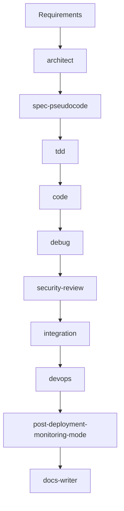

# 🛠️ Claude-Flow Development Workflow Guide

## Table of Contents

- [Getting Started](#getting-started)
- [Development Environment](#development-environment)
- [Project Structure](#project-structure)
- [Development Workflow](#development-workflow)
- [SPARC Development](#sparc-development)
- [Swarm Development](#swarm-development)
- [Testing Strategy](#testing-strategy)
- [Code Standards](#code-standards)
- [CI/CD Pipeline](#cicd-pipeline)
- [Contributing](#contributing)
- [Release Process](#release-process)
- [Best Practices](#best-practices)

---

## Getting Started

### Prerequisites for Development

```bash
# Required tools (as per package.json engines)
node --version  # v20.0.0 or higher
npm --version   # v9.0.0 or higher
git --version   # v2.30.0 or higher

# Recommended tools
pnpm --version  # Preferred package manager (especially on Windows)
docker --version  # For containerized development
code --version  # VS Code for development
```

### Setting Up Development Environment

```bash
# Clone the repository
git clone https://github.com/ruvnet/claude-flow.git
cd claude-flow

# Install dependencies (use pnpm on Windows)
npm install
# OR on Windows:
# pnpm install

# Start development mode
npm run dev

# Build TypeScript
npm run build:ts

# Test the CLI binary
chmod +x ./bin/claude-flow
./bin/claude-flow --version
```

### Current Development Scripts (v2.0.0-alpha.88)

```json
{
  "scripts": {
    "dev": "tsx src/cli/main.ts",
    "build": "npm run clean && npm run update-version && npm run build:esm && npm run build:cjs && npm run build:binary",
    "build:esm": "tsc",
    "build:cjs": "tsc -p tsconfig.cjs.json",
    "build:ts": "npm run build:esm && npm run build:cjs",
    "build:binary": "pkg dist/cli/main.js --targets node20-linux-x64,node20-macos-x64,node20-win-x64 --output bin/claude-flow",
    "clean": "rm -rf dist dist-cjs",
    "test": "NODE_OPTIONS='--experimental-vm-modules' jest --bail --maxWorkers=1 --forceExit",
    "test:watch": "NODE_OPTIONS='--experimental-vm-modules' jest --watch",
    "test:coverage": "NODE_OPTIONS='--experimental-vm-modules' jest --coverage",
    "test:ci": "NODE_OPTIONS='--experimental-vm-modules' jest --ci --coverage --maxWorkers=2",
    "test:unit": "NODE_OPTIONS='--experimental-vm-modules' jest src/__tests__/unit",
    "test:integration": "NODE_OPTIONS='--experimental-vm-modules' jest src/__tests__/integration",
    "test:e2e": "NODE_OPTIONS='--experimental-vm-modules' jest src/__tests__/e2e",
    "test:performance": "NODE_OPTIONS='--experimental-vm-modules' jest src/__tests__/performance",
    "test:comprehensive": "node scripts/test-comprehensive.js",
    "lint": "eslint src --ext .ts --max-warnings 0",
    "format": "prettier --write 'src/**/*.{ts,js,json}'",
    "typecheck": "tsc --noEmit",
    "typecheck:watch": "tsc --noEmit --watch",
    "diagnostics": "node -e \"import('./dist/monitoring/diagnostics.js').then(m => m.DiagnosticManager.quickDiagnostic().then(console.log))\"",
    "health-check": "node -e \"import('./dist/monitoring/health-check.js').then(m => new m.HealthCheckManager().performHealthCheck().then(console.log))\""
  }
}
```

---

## Development Environment

### VS Code Configuration

```json
// .vscode/settings.json
{
  "editor.formatOnSave": true,
  "editor.defaultFormatter": "esbenp.prettier-vscode",
  "editor.codeActionsOnSave": {
    "source.fixAll.eslint": true
  },
  "typescript.tsdk": "node_modules/typescript/lib",
  "jest.autoRun": {
    "watch": true,
    "onSave": "test-src-file"
  },
  "files.exclude": {
    "**/dist": true,
    "**/node_modules": true,
    "**/.swarm": true
  }
}
```

### VS Code Extensions

```json
// .vscode/extensions.json
{
  "recommendations": [
    "dbaeumer.vscode-eslint",
    "esbenp.prettier-vscode",
    "ms-vscode.vscode-typescript-next",
    "orta.vscode-jest",
    "streetsidesoftware.code-spell-checker",
    "wayou.vscode-todo-highlight",
    "gruntfuggly.todo-tree",
    "eamodio.gitlens"
  ]
}
```

### Debug Configuration

```json
// .vscode/launch.json
{
  "version": "0.2.0",
  "configurations": [
    {
      "type": "node",
      "request": "launch",
      "name": "Debug CLI",
      "program": "${workspaceFolder}/src/cli/main.ts",
      "args": ["swarm", "test task"],
      "runtimeArgs": ["-r", "ts-node/register"],
      "sourceMaps": true,
      "env": {
        "NODE_ENV": "development",
        "CLAUDE_FLOW_DEBUG": "true"
      }
    },
    {
      "type": "node",
      "request": "launch",
      "name": "Debug Tests",
      "program": "${workspaceFolder}/node_modules/.bin/jest",
      "args": ["--runInBand", "--no-cache"],
      "console": "integratedTerminal",
      "internalConsoleOptions": "neverOpen"
    }
  ]
}
```

---

## Project Structure

### Directory Structure

```
claude-flow/
├── src/                    # Source code
│   ├── cli/               # CLI commands and entry points
│   ├── core/              # Core orchestration logic
│   ├── agents/            # Agent implementations
│   ├── swarm/             # Swarm coordination
│   ├── task/              # Task management
│   ├── memory/            # Memory system
│   ├── providers/         # LLM provider integrations
│   ├── api/               # REST API implementation
│   ├── mcp/               # MCP protocol implementation
│   ├── hooks/             # Hook system
│   ├── monitoring/        # Health check and diagnostics
│   ├── utils/             # Utility functions
│   └── types/             # TypeScript type definitions
├── tests/                  # Test suites
│   ├── unit/              # Unit tests
│   ├── integration/       # Integration tests
│   ├── e2e/               # End-to-end tests
│   └── performance/       # Performance tests
├── docs/                   # Documentation
│   ├── API_DOCUMENTATION.md
│   ├── ARCHITECTURE.md
│   ├── DEPLOYMENT.md
│   └── INDEX.md
├── examples/               # Example code and tutorials
│   ├── 01-basic-usage/
│   ├── 02-advanced-patterns/
│   ├── 03-swarm-orchestration/
│   ├── 04-mcp-integration/
│   ├── 05-swarm-apps/
│   └── 06-tutorials/
├── scripts/                # Build and utility scripts
├── .claude/                # Claude-specific configurations
│   ├── agents/            # Agent definitions
│   ├── checkpoints/       # Session checkpoints
│   └── metrics/           # Performance metrics
├── bin/                    # Binary executables
│   ├── claude-flow        # Main CLI binary
│   ├── claude-flow-swarm  # Swarm-specific binary
│   └── claude-flow-ui     # UI binary
└── .github/                # GitHub workflows and templates
```

### Module Organization

```typescript
// src/core/orchestrator.ts
export class Orchestrator {
  // Main orchestration logic
}

// src/agents/base.ts
export abstract class BaseAgent {
  // Base agent implementation
}

// src/agents/specialized/coder.ts
export class CoderAgent extends BaseAgent {
  // Specialized coder agent
}

// src/swarm/coordinator.ts
export class SwarmCoordinator {
  // Swarm coordination logic
}

// src/memory/manager.ts
export class MemoryManager {
  // Memory management system
}
```

---

## Development Workflow

### Git Workflow

#### Branch Strategy

```bash
main                # Production-ready code
├── develop         # Integration branch
│   ├── feature/*   # Feature branches
│   ├── fix/*       # Bug fix branches
│   └── refactor/*  # Refactoring branches
├── release/*       # Release preparation
└── hotfix/*        # Emergency fixes
```

#### Creating a Feature with SPARC

```bash
# Create feature branch
git checkout -b feature/agent-improvements

# Use SPARC for architecture
npx claude-flow@alpha sparc run architect "Agent selection improvements"

# Implement with TDD
npx claude-flow@alpha sparc run tdd "Better agent selection algorithm"

# Start development mode
npm run dev

# Run comprehensive tests
npm run test:comprehensive
npm run test:coverage

# Security review
npx claude-flow@alpha sparc run security-review "Review agent selection"

# Commit changes
git add .
git commit -m "feat: improve agent selection algorithm"

# Push to remote
git push origin feature/agent-improvements

# Create pull request with swarm review
npx claude-flow@alpha swarm spawn code-review-swarm
gh pr create --title "Improve agent selection" --body "..."
```

### Commit Convention

We follow [Conventional Commits](https://www.conventionalcommits.org/):

```bash
# Format
<type>(<scope>): <subject>

# Types
feat:     # New feature
fix:      # Bug fix
docs:     # Documentation
style:    # Code style
refactor: # Refactoring
test:     # Tests
chore:    # Maintenance
perf:     # Performance

# Examples
feat(agents): add new ml-developer agent type
fix(swarm): resolve coordination deadlock issue
docs(api): update REST API documentation
test(memory): add unit tests for memory manager
```

### Code Review Process

```markdown
## Pull Request Template

### Description
Brief description of changes

### Type of Change
- [ ] Bug fix
- [ ] New feature
- [ ] Breaking change
- [ ] Documentation update

### Testing
- [ ] Unit tests pass
- [ ] Integration tests pass
- [ ] Manual testing completed

### Checklist
- [ ] Code follows style guidelines
- [ ] Self-review completed
- [ ] Comments added for complex code
- [ ] Documentation updated
- [ ] No new warnings
```

---

## SPARC Development

### Available SPARC Modes (16 Total)

```bash
# List all available modes
npx claude-flow@alpha sparc modes

# Available modes:
# 🏗️ architect              - System architecture design
# 🧠 code                   - Auto-coding and implementation
# 🧪 tdd                    - Test-driven development
# 🪲 debug                  - Debugging and troubleshooting
# 🛡️ security-review        - Security analysis
# 📚 docs-writer            - Documentation generation
# 🔗 integration            - System integration
# 📈 post-deployment-monitoring-mode - Deployment monitoring
# 🧹 refinement-optimization-mode - Code optimization
# ❓ ask                     - Interactive Q&A
# 🚀 devops                 - DevOps and deployment
# 📘 tutorial               - SPARC tutorial mode
# 🔐 supabase-admin         - Supabase administration
# 📋 spec-pseudocode        - Specification writing
# ♾️ mcp                    - MCP integration
# ⚡️ sparc                  - SPARC orchestration
```

### Using SPARC Modes

```bash
# Single mode execution
npx claude-flow@alpha sparc run architect "Design user authentication system"
npx claude-flow@alpha sparc run tdd "Implement user login functionality"
npx claude-flow@alpha sparc run security-review "Review API endpoints"

# Batch mode execution (multiple modes)
npx claude-flow@alpha sparc batch architect,tdd,security-review "Build secure API"

# Full pipeline execution
npx claude-flow@alpha sparc pipeline "Complete user management system"

# TDD workflow
npx claude-flow@alpha sparc tdd "User registration feature"
```

### SPARC Development Workflow



---

## Swarm Development

### Swarm Architecture

```bash
# Initialize swarm with different topologies
npx claude-flow@alpha swarm init --topology mesh --max-agents 10
npx claude-flow@alpha swarm init --topology hierarchical --max-agents 15
npx claude-flow@alpha swarm init --topology adaptive --max-agents 8

# Spawn specialized agents
npx claude-flow@alpha swarm spawn coder
npx claude-flow@alpha swarm spawn reviewer
npx claude-flow@alpha swarm spawn tester
npx claude-flow@alpha swarm spawn system-architect

# Coordinate multi-agent tasks
npx claude-flow@alpha swarm coordinate "Build full-stack application"
```

### Available Agent Types (54 Total)

#### Core Development Agents
```bash
- coder                    # Implementation specialist
- reviewer                 # Code quality reviewer
- tester                   # Test creation and validation
- planner                  # Strategic planning
- researcher               # Information gathering
- backend-dev              # API development
- mobile-dev               # React Native/mobile
- ml-developer             # Machine learning
- system-architect         # High-level design
- sparc-coder              # TDD implementation
- production-validator     # Real environment validation
```

#### Swarm Coordination Agents
```bash
- hierarchical-coordinator     # Queen-led coordination
- mesh-coordinator            # Peer-to-peer coordination
- adaptive-coordinator        # Dynamic topology
- collective-intelligence-coordinator  # Hive-mind
- swarm-memory-manager       # Distributed memory
- byzantine-coordinator      # Fault tolerance
- raft-manager              # Leader election
- consensus-builder         # Decision-making
```

#### GitHub Integration Agents
```bash
- github-modes              # Comprehensive integration
- pr-manager                # Pull requests
- code-review-swarm         # Multi-agent review
- issue-tracker             # Issue management
- release-manager           # Release coordination
```

### Swarm Patterns

#### Full-Stack Development Swarm
```javascript
// Spawn 8-agent full-stack swarm
const swarm = {
  architecture: "system-architect",
  backend: "backend-dev",
  frontend: "mobile-dev",
  database: "coder",
  api_docs: "api-docs",
  cicd: "cicd-engineer",
  testing: "performance-benchmarker",
  validation: "production-validator"
};
```

#### Code Review Swarm
```javascript
// Multi-agent code review
const reviewSwarm = {
  security: "security-review",
  performance: "perf-analyzer",
  quality: "reviewer",
  testing: "tester",
  documentation: "docs-writer"
};
```

---

## Testing Strategy

### Current Test Configuration (Jest with ESM)

```javascript
// jest.config.js
export default {
  preset: 'ts-jest/presets/default-esm',
  extensionsToTreatAsEsm: ['.ts'],
  testEnvironment: 'node',
  roots: ['<rootDir>/src', '<rootDir>/tests'],
  testMatch: [
    '<rootDir>/tests/**/*.test.ts',
    '<rootDir>/src/**/*.test.ts'
  ],
  transform: {
    '^.+\\.ts$': ['ts-jest', {
      useESM: true,
      tsconfig: {
        module: 'es2022',
        target: 'es2022'
      }
    }]
  },
  coverageDirectory: 'coverage',
  coverageReporters: ['text', 'lcov', 'html'],
  testTimeout: 30000
};
```

### Test Structure

```typescript
// tests/unit/agents/coder.test.ts
import { CoderAgent } from '../../../src/agents/specialized/coder.js';

describe('CoderAgent', () => {
  let agent: CoderAgent;
  
  beforeEach(() => {
    agent = new CoderAgent();
  });
  
  describe('execute', () => {
    it('should generate code for given task', async () => {
      const task = {
        type: 'code_generation',
        description: 'Create hello world function'
      };
      
      const result = await agent.execute(task);
      
      expect(result.success).toBe(true);
      expect(result.output).toContain('function');
    });
    
    it('should handle errors gracefully', async () => {
      const task = { type: 'invalid' };
      
      await expect(agent.execute(task)).rejects.toThrow();
    });
  });
});
```

### Current Test Commands

```bash
# All tests with ESM support
npm test  # NODE_OPTIONS='--experimental-vm-modules' jest --bail --maxWorkers=1 --forceExit

# Specific test suites
npm run test:unit          # Unit tests only
npm run test:integration   # Integration tests
npm run test:e2e           # End-to-end tests
npm run test:performance   # Performance tests
npm run test:cli           # CLI tests

# Coverage reports
npm run test:coverage      # Generate coverage report
npm run test:coverage:unit # Unit test coverage
npm run test:ci           # CI-optimized tests

# Advanced testing
npm run test:comprehensive # Comprehensive test suite
npm run test:debug        # Debug mode with inspect
npm run test:watch        # Watch mode

# Health and diagnostics
npm run test:health       # System health tests
npm run test:swarm        # Swarm coordination tests
npm run test:benchmark    # Performance benchmarks
```

#### Test Coverage Requirements

Current coverage target: **80%** (as configured in CI/CD)

```bash
# Generate detailed coverage report
npm run test:coverage

# Coverage by test type
npm run test:coverage:unit        # Unit test coverage
npm run test:coverage:integration # Integration coverage
npm run test:coverage:e2e         # E2E coverage

# View coverage report
open coverage/lcov-report/index.html
```

### Current Dependencies (v2.0.0-alpha.88)

#### Core Dependencies
```json
{
  "@modelcontextprotocol/sdk": "^1.0.4",
  "blessed": "^0.1.81",
  "chalk": "^4.1.2",
  "cli-table3": "^0.6.3",
  "commander": "^11.1.0",
  "cors": "^2.8.5",
  "figlet": "^1.8.1",
  "fs-extra": "^11.2.0",
  "glob": "^11.0.3",
  "inquirer": "^9.2.12",
  "nanoid": "^5.0.4",
  "ora": "^7.0.1",
  "ruv-swarm": "^1.0.14",
  "ws": "^8.18.3",
  "yaml": "^2.8.0"
}
```

#### Development Dependencies
```json
{
  "@types/node": "^20.19.7",
  "@typescript-eslint/eslint-plugin": "^6.21.0",
  "@typescript-eslint/parser": "^6.21.0",
  "eslint": "^8.57.1",
  "jest": "^29.7.0",
  "prettier": "^3.1.1",
  "ts-jest": "^29.4.0",
  "tsx": "^4.6.2",
  "typescript": "^5.3.3"
}
```

---

## Code Standards

### TypeScript Configuration

```json
// tsconfig.json
{
  "compilerOptions": {
    "target": "ES2022",
    "module": "ES2022",
    "lib": ["ES2022"],
    "outDir": "./dist",
    "rootDir": "./src",
    "strict": true,
    "esModuleInterop": true,
    "skipLibCheck": true,
    "forceConsistentCasingInFileNames": true,
    "resolveJsonModule": true,
    "declaration": true,
    "declarationMap": true,
    "sourceMap": true,
    "noUnusedLocals": true,
    "noUnusedParameters": true,
    "noImplicitReturns": true,
    "noFallthroughCasesInSwitch": true
  },
  "include": ["src/**/*"],
  "exclude": ["node_modules", "dist", "tests"]
}
```

### ESLint Configuration

```json
// .eslintrc.json
{
  "parser": "@typescript-eslint/parser",
  "extends": [
    "eslint:recommended",
    "plugin:@typescript-eslint/recommended",
    "plugin:jest/recommended",
    "prettier"
  ],
  "plugins": ["@typescript-eslint", "jest"],
  "env": {
    "node": true,
    "jest": true
  },
  "rules": {
    "@typescript-eslint/explicit-function-return-type": "warn",
    "@typescript-eslint/no-explicit-any": "error",
    "@typescript-eslint/no-unused-vars": ["error", { "argsIgnorePattern": "^_" }],
    "no-console": ["warn", { "allow": ["warn", "error"] }],
    "prefer-const": "error",
    "no-var": "error"
  }
}
```

### Prettier Configuration

```json
// .prettierrc.json
{
  "semi": true,
  "trailingComma": "es5",
  "singleQuote": true,
  "printWidth": 100,
  "tabWidth": 2,
  "useTabs": false,
  "bracketSpacing": true,
  "arrowParens": "always",
  "endOfLine": "lf"
}
```

---

## CI/CD Pipeline

### Current GitHub Actions Workflows

#### Main CI/CD Pipeline (.github/workflows/ci.yml)

```yaml
name: CI/CD Pipeline

on:
  push:
    branches: [ main, develop ]
  pull_request:
    branches: [ main ]
  schedule:
    - cron: '0 2 * * *'  # Daily at 2 AM UTC

env:
  NODE_VERSION: '20'

jobs:
  security:
    name: Security & Code Quality
    runs-on: ubuntu-latest
    steps:
      - name: Checkout code
        uses: actions/checkout@v4
      - name: Setup Node.js
        uses: actions/setup-node@v4
        with:
          node-version: ${{ env.NODE_VERSION }}
          cache: 'npm'
      - name: Install dependencies
        run: npm ci
      - name: Run security audit
        run: |
          npm audit --audit-level=high
          npm audit --production --audit-level=moderate
      - name: Lint code
        run: npm run lint
      - name: Type check
        run: npm run typecheck

  test:
    name: Test Suite
    runs-on: ubuntu-latest
    steps:
      - name: Checkout code
        uses: actions/checkout@v4
      - name: Setup Node.js
        uses: actions/setup-node@v4
        with:
          node-version: ${{ env.NODE_VERSION }}
          cache: 'npm'
      - name: Install dependencies
        run: npm ci
      - name: Run all tests
        run: npm test
      - name: Generate coverage report
        run: npm run test:coverage
      - name: Upload test results
        uses: actions/upload-artifact@v4
        with:
          name: test-results
          path: coverage/

  build:
    name: Build & Package
    runs-on: ubuntu-latest
    needs: [security, test]
    steps:
      - name: Checkout code
        uses: actions/checkout@v4
      - name: Setup Node.js
        uses: actions/setup-node@v4
        with:
          node-version: ${{ env.NODE_VERSION }}
          cache: 'npm'
      - name: Install dependencies
        run: npm ci
      - name: Build project
        run: npm run build:ts
      - name: Test CLI binary
        run: |
          chmod +x ./bin/claude-flow
          ./bin/claude-flow --version
```

#### Test Workflow (.github/workflows/test.yml)

```yaml
name: Test Suite

on:
  push:
    branches: [ main, develop, claude-flow-v2.0.0 ]
  pull_request:
    branches: [ main, develop ]

jobs:
  test:
    runs-on: ubuntu-latest
    strategy:
      matrix:
        node-version: [18.x, 20.x]
    steps:
    - name: Checkout code
      uses: actions/checkout@v4
    - name: Setup Node.js ${{ matrix.node-version }}
      uses: actions/setup-node@v4
      with:
        node-version: ${{ matrix.node-version }}
        cache: 'npm'
    - name: Install dependencies
      run: npm ci
    - name: Run linting
      run: npm run lint
    - name: Run all tests
      run: npm test
    - name: Generate coverage report
      run: npm run test:coverage

  code-quality:
    runs-on: ubuntu-latest
    steps:
    - name: Checkout code
      uses: actions/checkout@v4
    - name: Setup Node.js
      uses: actions/setup-node@v4
      with:
        node-version: '20.x'
        cache: 'npm'
    - name: Install dependencies
      run: npm ci
    - name: Check code formatting
      run: |
        npm run format
        git diff --exit-code
    - name: Run linting
      run: npm run lint
```

### Release Process (Alpha)

```bash
# Current alpha release process
npm run update-version
npm run build
npm test
npm publish --tag alpha

# Version management
npm version prerelease --preid=alpha  # 2.0.0-alpha.88 -> 2.0.0-alpha.89
```

---

## Contributing

### Setting Up for Contribution

```bash
# Fork the repository on GitHub

# Clone your fork
git clone https://github.com/YOUR_USERNAME/claude-flow.git
cd claude-flow

# Add upstream remote
git remote add upstream https://github.com/ruvnet/claude-flow.git

# Keep your fork updated
git fetch upstream
git checkout main
git merge upstream/main
```

### Development Process with SPARC and Swarm

```bash
# 1. Create feature branch
git checkout -b feature/your-feature

# 2. Plan with SPARC architect
npx claude-flow@alpha sparc run architect "Your feature description"

# 3. Implement with TDD
npx claude-flow@alpha sparc run tdd "Feature implementation"

# 4. Make changes and test
npm run dev
npm run test:comprehensive
npm run lint

# 5. Security review
npx claude-flow@alpha sparc run security-review "Review changes"

# 6. Commit changes
git add .
git commit -m "feat: add amazing feature"

# 7. Push to your fork
git push origin feature/your-feature

# 8. Create pull request with swarm review
npx claude-flow@alpha swarm spawn code-review-swarm
gh pr create --repo ruvnet/claude-flow
```

### Code Review Guidelines

#### For Contributors

1. **Write clear PR descriptions**
2. **Include tests for new features**
3. **Update documentation**
4. **Follow code style guidelines**
5. **Respond to review feedback**

#### For Reviewers

1. **Test the changes locally**
2. **Check code quality and style**
3. **Verify test coverage**
4. **Provide constructive feedback**
5. **Approve when ready**

---

## Release Process

### Current Version Management (Alpha Release)

```bash
# Current version: 2.0.0-alpha.88

# Alpha releases (current workflow)
npm version prerelease --preid=alpha  # 2.0.0-alpha.88 -> 2.0.0-alpha.89
npm run publish:alpha

# Future stable releases
npm run publish:patch  # Bug fixes
npm run publish:minor  # New features
npm run publish:major  # Breaking changes

# Available publish scripts
npm run publish:alpha  # Alpha release
npm run publish:major  # Major version bump
npm run publish:minor  # Minor version bump
npm run publish:patch  # Patch version bump
```

### Release Checklist

```markdown
## Release Checklist

### Pre-release
- [ ] All tests passing
- [ ] Documentation updated
- [ ] CHANGELOG.md updated
- [ ] Version bumped
- [ ] Dependencies updated

### Release
- [ ] Tag created
- [ ] GitHub release created
- [ ] NPM package published
- [ ] Docker image pushed
- [ ] Announcement prepared

### Post-release
- [ ] Documentation site updated
- [ ] Community notified
- [ ] Issues triaged
- [ ] Next version planned
```

### Changelog Generation

```bash
# Install conventional-changelog
npm install -g conventional-changelog-cli

# Generate changelog
conventional-changelog -p angular -i CHANGELOG.md -s

# Or use npm script
npm run changelog
```

---

## Best Practices

### Code Organization

```typescript
// ✅ Good: Single responsibility
export class TaskQueue {
  private queue: Task[] = [];
  
  enqueue(task: Task): void {
    this.queue.push(task);
  }
  
  dequeue(): Task | undefined {
    return this.queue.shift();
  }
}

// ❌ Bad: Multiple responsibilities
export class TaskManager {
  private queue: Task[] = [];
  private agents: Agent[] = [];
  private memory: Memory;
  
  // Too many responsibilities in one class
  enqueueTask() { /* ... */ }
  assignAgent() { /* ... */ }
  saveMemory() { /* ... */ }
}
```

### Error Handling

```typescript
// ✅ Good: Specific error types
export class AgentNotFoundError extends Error {
  constructor(agentId: string) {
    super(`Agent not found: ${agentId}`);
    this.name = 'AgentNotFoundError';
  }
}

// ✅ Good: Proper error handling
async function executeTask(task: Task): Promise<TaskResult> {
  try {
    const agent = await selectAgent(task);
    return await agent.execute(task);
  } catch (error) {
    if (error instanceof AgentNotFoundError) {
      // Handle specific error
      return createFailureResult('No suitable agent');
    }
    // Re-throw unexpected errors
    throw error;
  }
}
```

### Testing Best Practices

```typescript
// ✅ Good: Descriptive test names
describe('SwarmCoordinator', () => {
  describe('when coordinating agents', () => {
    it('should distribute tasks evenly among available agents', () => {
      // Test implementation
    });
    
    it('should handle agent failures gracefully', () => {
      // Test implementation
    });
  });
});

// ✅ Good: Use test fixtures
const createTestAgent = (overrides?: Partial<Agent>): Agent => {
  return {
    id: 'test-agent',
    type: 'coder',
    status: 'active',
    ...overrides
  };
};
```

### Performance Optimization

```typescript
// ✅ Good: Efficient data structures
class AgentPool {
  private availableAgents = new Set<Agent>();
  private busyAgents = new Map<string, Agent>();
  
  getAvailable(): Agent | undefined {
    const agent = this.availableAgents.values().next().value;
    if (agent) {
      this.availableAgents.delete(agent);
      this.busyAgents.set(agent.id, agent);
    }
    return agent;
  }
}

// ✅ Good: Avoid unnecessary operations
async function processTask(tasks: Task[]): Promise<void> {
  // Process in parallel when possible
  await Promise.all(
    tasks.map(task => processIndividualTask(task))
  );
}
```

### Documentation

```typescript
/**
 * Coordinates multiple agents to achieve a complex objective
 * @param objective - The high-level goal to achieve
 * @param options - Configuration options for coordination
 * @returns Promise resolving to the coordination result
 * @example
 * ```typescript
 * const result = await coordinator.coordinate(
 *   'Build REST API',
 *   { topology: 'mesh', maxAgents: 10 }
 * );
 * ```
 */
export async function coordinate(
  objective: string,
  options?: CoordinationOptions
): Promise<CoordinationResult> {
  // Implementation
}
```

---

## Development Tools

### Current Build System

```bash
# Multi-target build system
npm run build              # Full build pipeline
npm run build:esm          # ESM build
npm run build:cjs          # CommonJS build
npm run build:binary       # Binary executables

# Binary targets (pkg)
# - node20-linux-x64
# - node20-macos-x64
# - node20-win-x64

# Available binaries
./bin/claude-flow          # Main CLI
./bin/claude-flow-swarm    # Swarm coordination
./bin/claude-flow-ui       # UI interface
./bin/claude-flow-dev      # Development mode
```

### Health Monitoring and Diagnostics

```bash
# System diagnostics
npm run diagnostics

# Health check
npm run health-check

# Performance monitoring
npm run test:performance
npm run test:benchmark

# Load testing
npm run test:load

# Docker testing
npm run test:docker

# NPX testing
npm run test:npx
```

### Debug Utilities

```typescript
// src/utils/debug.ts
export const debug = {
  log: (message: string, data?: any) => {
    if (process.env.CLAUDE_FLOW_DEBUG === 'true') {
      console.log(`[DEBUG] ${message}`, data || '');
    }
  },
  
  time: (label: string) => {
    if (process.env.CLAUDE_FLOW_DEBUG === 'true') {
      console.time(label);
    }
  },
  
  timeEnd: (label: string) => {
    if (process.env.CLAUDE_FLOW_DEBUG === 'true') {
      console.timeEnd(label);
    }
  }
};
```

### Performance Profiling

```bash
# Profile CPU usage
node --prof dist/cli/main.js swarm "complex task"
node --prof-process isolate-*.log > profile.txt

# Memory profiling
node --trace-gc dist/cli/main.js swarm "memory intensive"
node --expose-gc --inspect dist/cli/main.js

# Heap snapshot
node --heapsnapshot-signal=SIGUSR2 dist/cli/main.js
```

---

## Troubleshooting Development Issues

### Common Development Problems

#### TypeScript Compilation Errors

```bash
# Clear TypeScript cache
rm -rf dist tsconfig.tsbuildinfo

# Rebuild
npm run clean && npm run build

# Check for type errors
npm run typecheck
```

#### Test Failures

```bash
# Clear Jest cache
npx jest --clearCache

# Run tests in band (sequential)
npm test -- --runInBand

# Debug specific test
npm test -- --verbose path/to/test.ts
```

#### Dependency Issues

```bash
# Clear all caches
npm cache clean --force
rm -rf node_modules package-lock.json

# Reinstall
npm install

# Check for outdated packages
npm outdated

# Update dependencies
npm update
```

---

## Resources

### Documentation

- [TypeScript Handbook](https://www.typescriptlang.org/docs/)
- [Jest Documentation](https://jestjs.io/docs/getting-started)
- [Node.js Best Practices](https://github.com/goldbergyoni/nodebestpractices)
- [Conventional Commits](https://www.conventionalcommits.org/)

### Tools

- [VS Code](https://code.visualstudio.com/)
- [Postman](https://www.postman.com/) - API testing
- [Docker Desktop](https://www.docker.com/products/docker-desktop)
- [GitHub CLI](https://cli.github.com/)

### Community

- [Discord Server](https://discord.gg/claude-flow)
- [GitHub Discussions](https://github.com/ruvnet/claude-flow/discussions)
- [Stack Overflow](https://stackoverflow.com/questions/tagged/claude-flow)

---

<div align="center">

**Claude-Flow Development Workflow v2.0.0-alpha.88**

[Back to README](../README.md) | [Contributing](../CONTRIBUTING.md) | [Code of Conduct](../CODE_OF_CONDUCT.md)

</div>