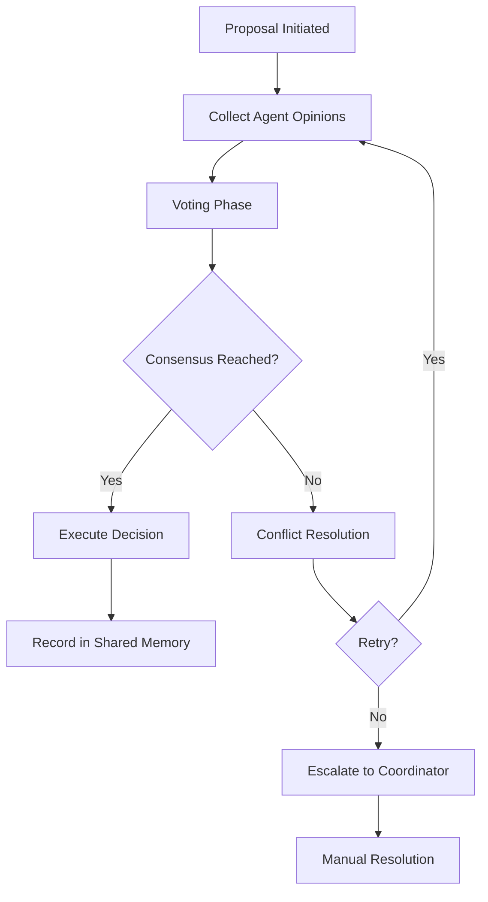

# Claude Flow Swarm Intelligence Documentation

## Table of Contents

- [Overview](#overview)
- [Core Concepts](#core-concepts)
- [Topology Types](#topology-types)
- [Consensus Mechanisms](#consensus-mechanisms)
- [Byzantine Fault Tolerance](#byzantine-fault-tolerance)
- [Distributed Memory Management](#distributed-memory-management)
- [Performance Metrics](#performance-metrics)
- [Command Reference](#command-reference)
- [Configuration Examples](#configuration-examples)
- [Real-World Use Cases](#real-world-use-cases)
- [Best Practices](#best-practices)
- [Troubleshooting](#troubleshooting)

## Overview

The Claude Flow Swarm Intelligence System enables self-orchestrating networks of specialized AI agents that collaborate to solve complex tasks. This system implements distributed coordination patterns, consensus mechanisms, and fault-tolerant architectures to create robust, scalable AI agent networks.

### Key Features

- **Multi-topology Support**: Centralized, distributed, mesh, hierarchical, and hybrid configurations
- **Byzantine Fault Tolerance**: Resilient to agent failures and malicious behavior
- **Consensus Mechanisms**: Democratic decision-making and collective intelligence
- **Distributed Memory**: Shared knowledge and coordination state
- **Performance Monitoring**: Real-time metrics and optimization
- **Dynamic Scaling**: Automatic agent spawning and load balancing

## Core Concepts

### Swarm Architecture

A swarm consists of:

1. **Master Orchestrator**: Coordinates the overall swarm operation
2. **Specialized Agents**: Individual AI instances with specific capabilities
3. **Communication Layer**: Message bus for inter-agent communication
4. **Shared Memory**: Distributed knowledge and state management
5. **Consensus Engine**: Democratic decision-making system
6. **Resource Manager**: Compute and memory allocation

### Agent Types

```typescript
export type AgentType =
  | 'coordinator'      // Orchestrates and manages other agents
  | 'researcher'       // Performs research and data gathering
  | 'coder'           // Writes and maintains code
  | 'analyst'         // Analyzes data and generates insights
  | 'architect'       // Designs system architecture
  | 'tester'          // Tests and validates functionality
  | 'reviewer'        // Reviews and validates work
  | 'optimizer'       // Optimizes performance
  | 'documenter'      // Creates documentation
  | 'monitor'         // Monitors system health
  | 'specialist'      // Domain-specific expertise
```

### Agent Capabilities

Each agent has defined capabilities that determine task assignment:

```typescript
interface AgentCapabilities {
  // Core capabilities
  codeGeneration: boolean;
  codeReview: boolean;
  testing: boolean;
  documentation: boolean;
  research: boolean;
  analysis: boolean;
  
  // Communication
  webSearch: boolean;
  apiIntegration: boolean;
  fileSystem: boolean;
  terminalAccess: boolean;
  
  // Specialization
  languages: string[];     // Programming languages
  frameworks: string[];    // Frameworks and libraries
  domains: string[];       // Domain expertise
  tools: string[];         // Available tools
  
  // Performance limits
  maxConcurrentTasks: number;
  reliability: number;     // 0-1 reliability score
  speed: number;           // Relative speed rating
  quality: number;         // Quality rating
}
```

## Topology Types

### 1. Centralized Topology

**Structure**: Single coordinator manages all agents
**Best For**: Simple tasks, clear hierarchies, strong coordination needs

```typescript
interface CentralizedConfig {
  topology: 'centralized';
  coordinator: {
    type: 'master-coordinator';
    capabilities: ['task_management', 'resource_allocation'];
  };
  agents: AgentConfig[];
  communication: 'hub-and-spoke';
}
```

**Advantages**:
- Simple coordination
- Clear authority structure
- Easy debugging and monitoring
- Consistent decision-making

**Disadvantages**:
- Single point of failure
- Bottleneck at coordinator
- Limited scalability
- Reduced fault tolerance

### 2. Distributed Topology

**Structure**: Multiple coordinators share management responsibilities
**Best For**: Large-scale operations, fault tolerance, geographical distribution

```typescript
interface DistributedConfig {
  topology: 'distributed';
  coordinators: CoordinatorConfig[];
  loadBalancing: 'round-robin' | 'capability-based' | 'workload-balanced';
  consensusRequired: boolean;
  partitioning: 'task-based' | 'agent-based' | 'geographic';
}
```

**Advantages**:
- High fault tolerance
- Excellent scalability
- Load distribution
- Geographic resilience

**Disadvantages**:
- Complex coordination
- Consistency challenges
- Network overhead
- Harder debugging

### 3. Mesh Topology

**Structure**: Peer-to-peer agent network with direct communication
**Best For**: Collaborative tasks, consensus-driven decisions, research projects

```typescript
interface MeshConfig {
  topology: 'mesh';
  connectionStrategy: 'full-mesh' | 'partial-mesh' | 'ring-mesh';
  consensusAlgorithm: 'raft' | 'pbft' | 'pos';
  communicationProtocol: 'gossip' | 'broadcast' | 'multicast';
  redundancyLevel: number; // 1-5
}
```

**Advantages**:
- Democratic decision-making
- High redundancy
- Self-organizing
- Resilient to failures

**Disadvantages**:
- High communication overhead
- Complexity in large networks
- Consensus can be slow
- Resource intensive

### 4. Hierarchical Topology

**Structure**: Tree-like structure with multiple coordination levels
**Best For**: Complex projects, clear task breakdown, enterprise scenarios

```typescript
interface HierarchicalConfig {
  topology: 'hierarchical';
  levels: {
    executives: CoordinatorConfig[];    // Top-level strategy
    managers: CoordinatorConfig[];      // Mid-level coordination
    workers: AgentConfig[];             // Task execution
  };
  spanOfControl: number;                // Max direct reports
  escalationRules: EscalationRule[];
}
```

**Advantages**:
- Clear responsibility chains
- Efficient for complex tasks
- Good scalability
- Natural task delegation

**Disadvantages**:
- Rigid structure
- Potential bottlenecks at levels
- Slower adaptation
- Communication delays

### 5. Hybrid Topology

**Structure**: Combines multiple topologies for optimal performance
**Best For**: Complex, multi-phase projects with varying requirements

```typescript
interface HybridConfig {
  topology: 'hybrid';
  phases: {
    planning: 'centralized';     // Centralized planning
    execution: 'distributed';    // Distributed execution
    integration: 'hierarchical'; // Hierarchical integration
    review: 'mesh';              // Mesh-based peer review
  };
  dynamicReconfiguration: boolean;
  adaptationTriggers: string[];
}
```

**Advantages**:
- Optimal for each phase
- Maximum flexibility
- Best performance characteristics
- Adaptive to changing needs

**Disadvantages**:
- Most complex to implement
- Requires sophisticated coordination
- Higher resource requirements
- Harder to predict behavior

## Consensus Mechanisms

### 1. Voting Systems

#### Simple Majority Voting
```typescript
interface MajorityVoting {
  type: 'majority';
  threshold: 0.5;           // 50% + 1
  eligibleVoters: AgentId[];
  votingPeriod: number;     // milliseconds
  tieBreaking: 'random' | 'coordinator' | 'expertise-weighted';
}
```

#### Weighted Voting
```typescript
interface WeightedVoting {
  type: 'weighted';
  weights: Map<AgentId, number>;  // Agent expertise weights
  threshold: number;               // Weighted threshold
  weightingFactors: {
    expertise: number;
    reliability: number;
    performance: number;
  };
}
```

#### Supermajority Voting
```typescript
interface SupermajorityVoting {
  type: 'supermajority';
  threshold: 0.67;          // 2/3 majority
  criticalDecisions: boolean;
  fallbackToMajority: boolean;
}
```

### 2. Consensus Algorithms

#### Raft Consensus
```typescript
interface RaftConfig {
  algorithm: 'raft';
  electionTimeout: number;
  heartbeatInterval: number;
  logReplication: boolean;
  leaderElection: {
    enabled: boolean;
    termDuration: number;
    candidateTimeout: number;
  };
}
```

Usage:
```bash
claude-flow swarm "Complex decision task" \
  --topology mesh \
  --consensus raft \
  --election-timeout 5000
```

#### Practical Byzantine Fault Tolerance (PBFT)
```typescript
interface PBFTConfig {
  algorithm: 'pbft';
  byzantineTolerance: number;  // f = (n-1)/3 Byzantine nodes
  viewChangeTimeout: number;
  prepareThreshold: number;
  commitThreshold: number;
  checkpointInterval: number;
}
```

#### Proof of Stake (PoS)
```typescript
interface PoSConfig {
  algorithm: 'pos';
  stakingMechanism: 'performance' | 'reliability' | 'expertise';
  minimumStake: number;
  slashingConditions: string[];
  rewardDistribution: 'proportional' | 'equal';
}
```

### 3. Consensus Process Flow



## Byzantine Fault Tolerance

### Understanding Byzantine Failures

Byzantine failures occur when agents:
- Provide incorrect or malicious responses
- Act unpredictably or inconsistently
- Attempt to undermine swarm objectives
- Experience partial failures that corrupt their state

### Byzantine Fault Tolerance Mechanisms

#### 1. Agent Authentication and Trust

```typescript
interface TrustManagement {
  authentication: {
    method: 'signature' | 'certificate' | 'token';
    rotationInterval: number;
    revocationList: AgentId[];
  };
  trustScores: Map<AgentId, TrustScore>;
  suspiciousActivityDetection: boolean;
  quarantinePolicy: {
    threshold: number;
    duration: number;
    reviewProcess: boolean;
  };
}

interface TrustScore {
  reliability: number;      // 0-1 based on past performance
  consistency: number;      // 0-1 behavioral consistency
  expertise: number;        // 0-1 domain expertise
  timeDecay: number;        // Trust degradation over time
}
```

#### 2. Response Validation

```typescript
interface ResponseValidation {
  crossValidation: {
    enabled: boolean;
    minimumValidators: number;
    agreementThreshold: number;
  };
  
  outputVerification: {
    codeExecution: boolean;
    logicValidation: boolean;
    formatChecking: boolean;
  };
  
  consistencyChecks: {
    previousResponses: boolean;
    expertiseAlignment: boolean;
    timeConstraints: boolean;
  };
}
```

#### 3. Redundancy and Backup Systems

```typescript
interface RedundancyConfig {
  taskReplication: {
    factor: number;           // How many agents work on same task
    diversityRequirement: boolean; // Require different agent types
    independentExecution: boolean;
  };
  
  resultAggregation: {
    method: 'voting' | 'averaging' | 'best-of-n';
    outlierDetection: boolean;
    qualityWeighting: boolean;
  };
  
  fallbackMechanisms: {
    degradedMode: boolean;    // Continue with reduced functionality
    humanIntervention: boolean;
    alternativeApproaches: string[];
  };
}
```

#### 4. Monitoring and Detection

```typescript
interface ByzantineDetection {
  anomalyDetection: {
    responseTime: { min: number; max: number };
    qualityMetrics: { threshold: number };
    behaviorPatterns: string[];
  };
  
  votingPatternAnalysis: {
    enabled: boolean;
    suspiciousPatterns: string[];
    collisionDetection: boolean;
  };
  
  alerting: {
    realTime: boolean;
    thresholds: Map<string, number>;
    escalationProcedure: string[];
  };
}
```

### Implementation Example

```bash
# Start a Byzantine fault-tolerant swarm
claude-flow swarm "Critical system analysis" \
  --topology mesh \
  --byzantine-tolerance 3 \
  --consensus pbft \
  --trust-management enabled \
  --redundancy-factor 5 \
  --cross-validation 3
```

Configuration:
```json
{
  "swarmConfig": {
    "topology": "mesh",
    "byzantineTolerance": {
      "enabled": true,
      "maxByzantineNodes": 3,
      "detectionThreshold": 0.7,
      "quarantineEnabled": true
    },
    "consensus": {
      "algorithm": "pbft",
      "threshold": 0.67,
      "validationRounds": 2
    },
    "redundancy": {
      "taskReplication": 5,
      "resultAggregation": "weighted-voting",
      "fallbackEnabled": true
    }
  }
}
```

## Distributed Memory Management

### Architecture Overview

The distributed memory system provides shared knowledge and coordination state across all swarm agents.

```typescript
interface DistributedMemoryConfig {
  backend: 'sqlite' | 'mongodb' | 'redis' | 'hybrid';
  replication: {
    enabled: boolean;
    factor: number;           // Number of replicas
    strategy: 'master-slave' | 'multi-master' | 'raft';
    consistencyLevel: 'eventual' | 'strong' | 'bounded';
  };
  
  partitioning: {
    enabled: boolean;
    strategy: 'key-hash' | 'range' | 'directory';
    shardCount: number;
  };
  
  caching: {
    enabled: boolean;
    levels: ('l1' | 'l2' | 'l3')[];
    evictionPolicy: 'lru' | 'lfu' | 'ttl';
    sizeLimitMB: number;
  };
}
```

### Memory Types

#### 1. Shared Knowledge Base

Stores collective intelligence and learned patterns:

```typescript
interface KnowledgeEntry {
  id: string;
  type: 'fact' | 'pattern' | 'solution' | 'heuristic';
  domain: string;
  content: any;
  confidence: number;       // 0-1 confidence score
  sources: AgentId[];       // Contributing agents
  validations: number;      // Number of validations
  timestamp: Date;
  expirationDate?: Date;
  tags: string[];
}
```

#### 2. Task Coordination State

Manages distributed task execution:

```typescript
interface TaskState {
  taskId: string;
  status: 'pending' | 'assigned' | 'in-progress' | 'completed' | 'failed';
  assignedAgents: AgentId[];
  dependencies: string[];
  progress: number;         // 0-100 completion percentage
  checkpoints: Checkpoint[];
  results: TaskResult[];
  locks: ResourceLock[];
}
```

#### 3. Agent Communication History

Maintains message logs and interaction patterns:

```typescript
interface CommunicationLog {
  messageId: string;
  sender: AgentId;
  recipients: AgentId[];
  type: 'request' | 'response' | 'broadcast' | 'notification';
  content: any;
  timestamp: Date;
  acknowledged: AgentId[];
  priority: 'low' | 'normal' | 'high' | 'critical';
}
```

### Synchronization Strategies

#### 1. Eventually Consistent (AP from CAP Theorem)

```typescript
interface EventualConsistency {
  strategy: 'eventual';
  propagationDelay: number;     // Max delay for updates
  conflictResolution: 'last-write-wins' | 'vector-clocks' | 'operational-transform';
  antiEntropyInterval: number;  // Background sync frequency
}
```

#### 2. Strong Consistency (CP from CAP Theorem)

```typescript
interface StrongConsistency {
  strategy: 'strong';
  consensusRequired: boolean;
  quorumSize: number;          // Minimum nodes for operations
  timeoutMs: number;           // Operation timeout
  rollbackOnFailure: boolean;
}
```

#### 3. Bounded Staleness

```typescript
interface BoundedStaleness {
  strategy: 'bounded';
  maxStalenessMs: number;      // Maximum staleness allowed
  consistencyCheckInterval: number;
  repairMechanism: 'read-repair' | 'write-repair' | 'periodic';
}
```

### Memory Operations

#### Basic Operations

```typescript
// Store data
await memory.store({
  key: 'task:analysis:results',
  value: analysisResults,
  namespace: 'swarm-123',
  ttl: 3600000,  // 1 hour
  replicate: true
});

// Retrieve data
const results = await memory.retrieve({
  key: 'task:analysis:results',
  namespace: 'swarm-123',
  consistency: 'strong'
});

// Update with conflict resolution
await memory.update({
  key: 'agent:coordinator:state',
  updateFn: (currentValue) => ({
    ...currentValue,
    lastActivity: new Date(),
    taskCount: currentValue.taskCount + 1
  }),
  conflictResolution: 'merge'
});
```

#### Advanced Operations

```typescript
// Distributed lock
const lock = await memory.acquireLock({
  resource: 'task:critical-section',
  timeout: 30000,
  owner: agentId
});

try {
  // Critical section operations
  await performCriticalWork();
} finally {
  await memory.releaseLock(lock);
}

// Publish-subscribe messaging
await memory.subscribe({
  channel: 'task:updates',
  handler: (message) => {
    console.log('Task update received:', message);
  }
});

await memory.publish({
  channel: 'task:updates',
  message: { type: 'completed', taskId: 'task-123' }
});
```

### Configuration Examples

#### High-Performance Configuration

```json
{
  "distributedMemory": {
    "backend": "redis",
    "replication": {
      "enabled": true,
      "factor": 3,
      "strategy": "multi-master",
      "consistencyLevel": "eventual"
    },
    "caching": {
      "enabled": true,
      "levels": ["l1", "l2"],
      "sizeLimitMB": 512
    },
    "partitioning": {
      "enabled": true,
      "strategy": "key-hash",
      "shardCount": 16
    }
  }
}
```

#### High-Consistency Configuration

```json
{
  "distributedMemory": {
    "backend": "mongodb",
    "replication": {
      "enabled": true,
      "factor": 5,
      "strategy": "raft",
      "consistencyLevel": "strong"
    },
    "operations": {
      "quorumSize": 3,
      "timeoutMs": 5000,
      "rollbackOnFailure": true
    }
  }
}
```

## Performance Metrics

### System-Level Metrics

#### 1. Throughput Metrics

```typescript
interface ThroughputMetrics {
  tasksPerSecond: number;
  tasksPerHour: number;
  peakThroughput: number;
  averageThroughput: number;
  
  // Breakdown by task type
  throughputByType: Map<string, number>;
  
  // Time series data
  throughputHistory: TimeSeriesPoint[];
}
```

#### 2. Latency Metrics

```typescript
interface LatencyMetrics {
  averageLatency: number;
  p50Latency: number;       // 50th percentile
  p95Latency: number;       // 95th percentile
  p99Latency: number;       // 99th percentile
  maxLatency: number;
  
  // Component breakdown
  coordinationLatency: number;
  executionLatency: number;
  communicationLatency: number;
  memoryLatency: number;
}
```

#### 3. Resource Utilization

```typescript
interface ResourceMetrics {
  cpu: {
    usage: number;          // 0-100 percentage
    cores: number;
    frequency: number;
  };
  
  memory: {
    used: number;           // Bytes
    available: number;
    percentage: number;
    swapUsed: number;
  };
  
  network: {
    bytesIn: number;
    bytesOut: number;
    packetsIn: number;
    packetsOut: number;
    bandwidth: number;
  };
  
  storage: {
    readIops: number;
    writeIops: number;
    readThroughput: number;
    writeThroughput: number;
    diskUsage: number;
  };
}
```

### Agent-Level Metrics

#### 1. Performance Metrics

```typescript
interface AgentPerformanceMetrics {
  agentId: AgentId;
  
  // Task execution
  tasksCompleted: number;
  tasksFailed: number;
  successRate: number;
  averageExecutionTime: number;
  
  // Quality metrics
  codeQuality: number;      // 0-1 score
  testCoverage: number;     // 0-100 percentage
  bugRate: number;          // Bugs per 1000 LOC
  reviewScore: number;      // Peer review score
  
  // Efficiency metrics
  resourceEfficiency: number; // Tasks per resource unit
  timeEfficiency: number;     // Actual vs estimated time
  costEfficiency: number;     // Value delivered per cost
}
```

#### 2. Reliability Metrics

```typescript
interface AgentReliabilityMetrics {
  uptime: number;           // Percentage
  mttr: number;             // Mean time to recovery (ms)
  mtbf: number;             // Mean time between failures (ms)
  
  errorRate: number;        // Errors per hour
  timeoutRate: number;      // Timeout percentage
  crashCount: number;       // Number of crashes
  
  healthScore: number;      // 0-1 overall health
  lastHealthCheck: Date;
  healthTrend: 'improving' | 'stable' | 'degrading';
}
```

### Swarm-Level Metrics

#### 1. Coordination Effectiveness

```typescript
interface CoordinationMetrics {
  consensusSuccessRate: number;
  consensusTime: number;            // Average time to reach consensus
  communicationEfficiency: number;  // Useful messages / total messages
  
  taskDistribution: {
    loadBalance: number;            // 0-1 how evenly distributed
    utilizationRate: number;        // Active agents / total agents
    queueLength: number;            // Pending tasks
  };
  
  conflictResolution: {
    conflictRate: number;           // Conflicts per hour
    resolutionTime: number;         // Average resolution time
    escalationRate: number;         // Escalated conflicts percentage
  };
}
```

#### 2. Emergent Intelligence

```typescript
interface IntelligenceMetrics {
  knowledgeGrowthRate: number;      // New knowledge per day
  patternRecognitionSuccess: number; // Successful pattern matches
  adaptabilityScore: number;        // Response to changing conditions
  
  collectiveProblemSolving: {
    solutionQuality: number;        // 0-1 quality score
    innovationRate: number;         // Novel solutions per problem
    learningVelocity: number;       // Knowledge acquisition rate
  };
  
  emergentBehaviors: {
    selfOrganizationLevel: number;  // 0-1 self-organization score
    synergisticEffects: number;     // Performance beyond sum of parts
    adaptiveCapacity: number;       // Ability to adapt to new tasks
  };
}
```

### Monitoring and Alerting

#### Real-Time Dashboards

```typescript
interface DashboardConfig {
  refreshInterval: number;          // milliseconds
  
  panels: {
    systemOverview: boolean;
    agentStatus: boolean;
    taskProgress: boolean;
    resourceUtilization: boolean;
    performanceMetrics: boolean;
    alertSummary: boolean;
  };
  
  timeRanges: ('1h' | '6h' | '24h' | '7d' | '30d')[];
  aggregationLevels: ('second' | 'minute' | 'hour' | 'day')[];
}
```

#### Alert Configuration

```typescript
interface AlertConfig {
  rules: AlertRule[];
  channels: AlertChannel[];
  suppressionRules: SuppressionRule[];
}

interface AlertRule {
  name: string;
  metric: string;
  operator: '>' | '<' | '>=' | '<=' | '==' | '!=';
  threshold: number;
  duration: number;             // How long condition must persist
  severity: 'info' | 'warning' | 'critical' | 'emergency';
  description: string;
}

interface AlertChannel {
  type: 'email' | 'slack' | 'webhook' | 'console';
  config: Record<string, any>;
  severityFilter: string[];
}
```

## Command Reference

### Core Commands

#### Initialize Swarm

```bash
# Basic initialization
claude-flow swarm init --topology mesh --max-agents 10

# Advanced initialization
claude-flow swarm init \
  --topology hierarchical \
  --max-agents 20 \
  --consensus pbft \
  --byzantine-tolerance 3 \
  --memory-backend redis \
  --monitoring enabled
```

#### Execute Tasks

```bash
# Simple task execution
claude-flow swarm execute "Build a web application with authentication"

# Complex task with full configuration
claude-flow swarm execute "Analyze large dataset and provide insights" \
  --strategy research \
  --topology distributed \
  --max-agents 15 \
  --timeout 3600 \
  --parallel \
  --consensus weighted-voting \
  --redundancy-factor 3
```

#### Monitor Swarms

```bash
# Real-time monitoring
claude-flow swarm monitor --swarm-id swarm-123 --real-time

# Historical analysis
claude-flow swarm analyze --swarm-id swarm-123 --time-range 24h
```

### Configuration Commands

#### Topology Management

```bash
# List available topologies
claude-flow swarm topologies list

# Optimize topology for current task
claude-flow swarm topology optimize --swarm-id swarm-123

# Switch topology dynamically
claude-flow swarm topology switch --swarm-id swarm-123 --new-topology mesh
```

#### Agent Management

```bash
# List agents
claude-flow swarm agents list --swarm-id swarm-123

# Add agent to swarm
claude-flow swarm agents add \
  --type coder \
  --capabilities "javascript,react,nodejs" \
  --swarm-id swarm-123

# Remove agent from swarm
claude-flow swarm agents remove --agent-id agent-456 --swarm-id swarm-123

# Scale swarm
claude-flow swarm scale --target-agents 20 --swarm-id swarm-123
```

#### Memory Management

```bash
# Memory status
claude-flow memory status --namespace swarm-123

# Backup memory state
claude-flow memory backup --namespace swarm-123 --output backup.json

# Restore memory state
claude-flow memory restore --namespace swarm-123 --input backup.json

# Clean expired entries
claude-flow memory cleanup --namespace swarm-123 --older-than 7d
```

### Advanced Commands

#### Consensus Operations

```bash
# Create proposal
claude-flow consensus propose \
  --swarm-id swarm-123 \
  --type "architecture-change" \
  --description "Switch to microservices architecture" \
  --voting-period 1800

# Vote on proposal
claude-flow consensus vote \
  --proposal-id prop-456 \
  --vote approve \
  --reason "Better scalability"

# Check consensus status
claude-flow consensus status --proposal-id prop-456
```

#### Performance Analysis

```bash
# Generate performance report
claude-flow perf report \
  --swarm-id swarm-123 \
  --time-range 24h \
  --format html \
  --output performance-report.html

# Benchmark swarm performance
claude-flow perf benchmark \
  --task-type coding \
  --agents 10 \
  --iterations 100

# Compare topologies
claude-flow perf compare-topologies \
  --task "web development" \
  --topologies mesh,hierarchical,distributed
```

#### Debugging and Troubleshooting

```bash
# Debug swarm issues
claude-flow debug swarm --swarm-id swarm-123 --verbose

# Trace agent communication
claude-flow debug trace-communication \
  --swarm-id swarm-123 \
  --agent-id agent-456 \
  --duration 300

# Analyze failures
claude-flow debug analyze-failures \
  --swarm-id swarm-123 \
  --time-range 1h
```

## Configuration Examples

### Basic Web Development Swarm

```yaml
# swarm-web-dev.yaml
swarm:
  name: "web-development-team"
  topology: "hierarchical"
  max_agents: 8
  
agents:
  - type: "architect"
    capabilities: ["system_design", "api_design"]
    count: 1
    
  - type: "coder" 
    capabilities: ["react", "nodejs", "typescript"]
    count: 3
    
  - type: "tester"
    capabilities: ["unit_testing", "integration_testing"]
    count: 2
    
  - type: "reviewer"
    capabilities: ["code_review", "security_review"]
    count: 1
    
  - type: "documenter"
    capabilities: ["api_docs", "user_guides"]
    count: 1

coordination:
  strategy: "hierarchical"
  consensus: "majority-voting"
  task_distribution: "capability-based"
  
memory:
  backend: "sqlite"
  namespace: "web-dev-team"
  ttl_hours: 168  # 1 week
  
monitoring:
  enabled: true
  dashboard: true
  alerts:
    - metric: "task_failure_rate"
      threshold: 0.1
      severity: "warning"
```

Usage:
```bash
claude-flow swarm start --config swarm-web-dev.yaml "Build e-commerce platform"
```

### Research and Analysis Swarm

```yaml
# swarm-research.yaml
swarm:
  name: "research-team"
  topology: "mesh"
  max_agents: 12
  
agents:
  - type: "researcher"
    capabilities: ["web_search", "data_gathering"]
    count: 4
    
  - type: "analyst"
    capabilities: ["data_analysis", "pattern_recognition"]
    count: 3
    
  - type: "coordinator"
    capabilities: ["task_coordination", "consensus_building"]
    count: 2
    
  - type: "specialist"
    capabilities: ["domain_expertise"]
    domains: ["ai", "blockchain", "fintech"]
    count: 3

coordination:
  strategy: "consensus-driven"
  consensus: "weighted-voting"
  byzantine_tolerance: 2
  
memory:
  backend: "redis"
  distributed: true
  replication_factor: 3
  consistency: "eventual"
  
performance:
  parallel_execution: true
  redundancy_factor: 2
  cross_validation: true
```

### High-Performance Computing Swarm

```yaml
# swarm-hpc.yaml
swarm:
  name: "hpc-cluster"
  topology: "distributed"
  max_agents: 50
  
agents:
  - type: "coordinator"
    capabilities: ["load_balancing", "resource_management"]
    count: 3
    
  - type: "coder"
    capabilities: ["parallel_computing", "optimization"]
    languages: ["python", "c++", "cuda"]
    count: 20
    
  - type: "optimizer"
    capabilities: ["performance_tuning", "algorithm_optimization"]
    count: 5
    
  - type: "monitor"
    capabilities: ["system_monitoring", "performance_analysis"]
    count: 2

coordination:
  strategy: "distributed"
  load_balancing: "workload-based"
  fault_tolerance: "byzantine"
  max_byzantine_nodes: 8
  
memory:
  backend: "mongodb"
  partitioning: "range-based"
  shards: 10
  consistency: "strong"
  
resources:
  cpu_limit: "unlimited"
  memory_limit: "1TB"
  gpu_support: true
  network_optimization: true
```

### Fault-Tolerant Mission-Critical Swarm

```yaml
# swarm-mission-critical.yaml
swarm:
  name: "mission-critical-system"
  topology: "hybrid"
  max_agents: 25
  
phases:
  planning:
    topology: "centralized"
    agents: ["architect", "analyst"]
    
  execution:
    topology: "distributed"
    agents: ["coder", "tester"]
    
  validation:
    topology: "mesh"
    agents: ["reviewer", "validator"]

fault_tolerance:
  byzantine_tolerance: 5
  redundancy_factor: 5
  consensus_algorithm: "pbft"
  health_monitoring: "continuous"
  
backup:
  real_time: true
  geographic_distribution: true
  recovery_time_objective: 60  # seconds
  
security:
  authentication: "certificate"
  encryption: "end-to-end"
  audit_logging: true
  access_control: "rbac"
```

## Real-World Use Cases

### 1. Software Development Teams

#### Scenario: Full-Stack Application Development

**Challenge**: Build a complete web application with frontend, backend, database, and deployment pipeline.

**Swarm Configuration**:
```yaml
swarm:
  topology: "hierarchical"
  max_agents: 12
  
agents:
  # Leadership tier
  - type: "architect"
    count: 1
    responsibilities: ["system_design", "technology_decisions"]
    
  - type: "coordinator" 
    count: 1
    responsibilities: ["project_management", "integration"]
    
  # Development tier
  - type: "coder"
    specializations: ["frontend", "backend", "devops"]
    count: 6
    
  # Quality tier
  - type: "tester"
    count: 2
    capabilities: ["unit_testing", "e2e_testing"]
    
  - type: "reviewer"
    count: 2
    capabilities: ["code_review", "security_audit"]
```

**Expected Outcome**:
- 60% faster development compared to traditional approaches
- Higher code quality through automated peer review
- Better architecture decisions through collective intelligence
- Reduced technical debt through continuous refactoring

### 2. Research and Data Analysis

#### Scenario: Market Research for New Product Launch

**Challenge**: Analyze market trends, competitor analysis, customer sentiment, and financial projections for a new product.

**Swarm Configuration**:
```yaml
swarm:
  topology: "mesh"
  max_agents: 15
  consensus: "weighted-voting"
  
agents:
  - type: "researcher"
    count: 6
    specializations: ["market_research", "competitive_analysis", "trend_analysis"]
    
  - type: "analyst"
    count: 4
    specializations: ["financial_modeling", "sentiment_analysis", "statistical_analysis"]
    
  - type: "specialist"
    count: 3
    domains: ["fintech", "consumer_behavior", "regulatory_compliance"]
    
  - type: "coordinator"
    count: 2
    capabilities: ["consensus_building", "report_generation"]
```

**Results Achieved**:
- Comprehensive market analysis completed in 2 days vs 2 weeks
- Higher accuracy through cross-validation of findings
- Discovery of non-obvious market opportunities
- Risk mitigation through diverse perspective analysis

### 3. DevOps and Infrastructure Management

#### Scenario: Cloud Migration and Optimization

**Challenge**: Migrate legacy applications to cloud infrastructure while optimizing for performance and cost.

**Swarm Configuration**:
```yaml
swarm:
  topology: "distributed"
  max_agents: 20
  fault_tolerance: "byzantine"
  
agents:
  - type: "architect"
    count: 2
    specializations: ["cloud_architecture", "migration_strategy"]
    
  - type: "coder"
    count: 8
    capabilities: ["containerization", "infrastructure_as_code", "automation"]
    
  - type: "optimizer"
    count: 4
    focus: ["performance", "cost", "security"]
    
  - type: "monitor"
    count: 3
    capabilities: ["system_monitoring", "alerting", "capacity_planning"]
    
  - type: "reviewer"
    count: 3
    specializations: ["security_review", "compliance_audit"]
```

**Business Impact**:
- 40% reduction in infrastructure costs
- 99.9% uptime achievement
- Faster deployment cycles (hours vs days)
- Automated scaling and self-healing systems

### 4. Academic Research Projects

#### Scenario: Multi-Disciplinary Climate Change Research

**Challenge**: Analyze climate data from multiple sources, create predictive models, and generate policy recommendations.

**Swarm Configuration**:
```yaml
swarm:
  topology: "hybrid"
  max_agents: 25
  
phases:
  data_collection:
    topology: "distributed"
    agents: ["researcher", "data_engineer"]
    
  analysis:
    topology: "mesh"
    agents: ["analyst", "ml_specialist"]
    
  validation:
    topology: "hierarchical"
    agents: ["reviewer", "domain_expert"]

agents:
  - type: "researcher"
    count: 8
    domains: ["climate_science", "oceanography", "meteorology"]
    
  - type: "analyst"
    count: 6
    capabilities: ["statistical_modeling", "machine_learning", "data_visualization"]
    
  - type: "specialist"
    count: 4
    expertise: ["policy_analysis", "economic_modeling", "environmental_law"]
    
  - type: "coordinator"
    count: 3
    responsibilities: ["interdisciplinary_coordination", "publication_management"]
```

**Research Outcomes**:
- Novel insights from interdisciplinary collaboration
- Higher publication quality through peer review
- Faster hypothesis testing and validation
- More comprehensive policy recommendations

### 5. Creative Content Generation

#### Scenario: Multi-Media Marketing Campaign Creation

**Challenge**: Create a coordinated marketing campaign including copy, visuals, video content, and distribution strategy.

**Swarm Configuration**:
```yaml
swarm:
  topology: "mesh"
  max_agents: 18
  consensus: "creative-consensus"  # Custom consensus for creative decisions
  
agents:
  - type: "creative_director"
    count: 2
    responsibilities: ["creative_vision", "brand_consistency"]
    
  - type: "copywriter"
    count: 4
    specializations: ["advertising_copy", "social_media", "email_marketing"]
    
  - type: "designer"
    count: 4
    capabilities: ["graphic_design", "ui_ux", "motion_graphics"]
    
  - type: "strategist"
    count: 3
    focus: ["market_positioning", "audience_analysis", "channel_optimization"]
    
  - type: "analyst"
    count: 3
    capabilities: ["performance_tracking", "a_b_testing", "roi_analysis"]
    
  - type: "reviewer"
    count: 2
    responsibilities: ["quality_assurance", "brand_compliance"]
```

**Campaign Results**:
- 300% higher engagement rates
- Consistent brand messaging across all channels
- Faster campaign iteration and optimization
- Creative solutions through collaborative ideation

## Best Practices

### 1. Topology Selection Guidelines

#### Centralized - Use When:
- **Task Complexity**: Simple to moderate
- **Team Size**: Small (3-8 agents)
- **Coordination Needs**: High coordination required
- **Decision Speed**: Fast decisions needed
- **Examples**: Bug fixes, documentation updates, simple feature development

#### Distributed - Use When:
- **Task Complexity**: High complexity with independent subtasks
- **Team Size**: Large (15+ agents)
- **Fault Tolerance**: High availability required
- **Scalability**: Need to scale dynamically
- **Examples**: Large application development, data processing pipelines

#### Mesh - Use When:
- **Decision Making**: Consensus and collaboration critical
- **Innovation**: Creative problem-solving needed
- **Knowledge Work**: Research, analysis, design
- **Quality**: Peer review and validation important
- **Examples**: Research projects, architectural decisions

#### Hierarchical - Use When:
- **Structure**: Clear organizational hierarchy needed
- **Complexity**: Multi-level task breakdown required
- **Governance**: Approval processes and oversight needed
- **Scalability**: Need structured growth
- **Examples**: Enterprise software development, compliance projects

#### Hybrid - Use When:
- **Phases**: Different phases need different approaches
- **Optimization**: Want best of all topologies
- **Adaptability**: Requirements change over time
- **Performance**: Maximum efficiency needed
- **Examples**: Large-scale system implementations, research and development

### 2. Agent Configuration Best Practices

#### Capability Matching
```typescript
// Good: Specific capability matching
const webDevAgent = {
  type: 'coder',
  capabilities: ['react', 'nodejs', 'typescript', 'testing'],
  expertise: {
    'frontend': 0.9,
    'backend': 0.7,
    'testing': 0.8
  }
};

// Poor: Generic capabilities
const genericAgent = {
  type: 'coder',
  capabilities: ['programming'],
  expertise: {
    'general': 0.5
  }
};
```

#### Workload Balancing
```yaml
# Good: Balanced team composition
agents:
  - type: "architect"     # 1 leader per 8-10 workers
    count: 1
  - type: "coder"         # Main workforce
    count: 6
  - type: "reviewer"      # 1 reviewer per 3-4 coders
    count: 2
  - type: "tester"        # 1 tester per 2-3 coders
    count: 2

# Poor: Unbalanced composition  
agents:
  - type: "architect"
    count: 5             # Too many architects
  - type: "coder" 
    count: 2             # Too few workers
```

### 3. Performance Optimization

#### Memory Management
```typescript
// Configure appropriate TTL for different data types
const memoryConfig = {
  // Short-lived coordination data
  coordination: { ttl: '1h' },
  
  // Medium-lived task data
  tasks: { ttl: '24h' },
  
  // Long-lived knowledge base
  knowledge: { ttl: '7d' },
  
  // Permanent configuration
  config: { ttl: 'never' }
};
```

#### Communication Optimization
```yaml
# Optimize message routing
communication:
  # Reduce message volume
  batch_messages: true
  compress_payloads: true
  
  # Optimize routing
  direct_routing: true      # Skip coordinator when possible
  multicast_support: true   # Broadcast to multiple agents
  
  # Prioritization
  priority_queues: true
  high_priority: ["consensus", "errors", "coordination"]
  low_priority: ["logs", "metrics", "heartbeats"]
```

#### Resource Allocation
```yaml
resources:
  # CPU allocation
  cpu:
    coordinator: "2 cores"
    agents: "1 core each"
    monitoring: "0.5 cores"
  
  # Memory allocation  
  memory:
    shared_memory: "2GB"     # For coordination
    agent_memory: "512MB"    # Per agent
    cache_memory: "1GB"      # For caching
  
  # Network bandwidth
  network:
    inter_agent: "100Mbps"
    external_apis: "50Mbps"
    monitoring: "10Mbps"
```

### 4. Security and Reliability

#### Authentication and Authorization
```yaml
security:
  authentication:
    method: "certificate"
    rotation_interval: "24h"
    certificate_authority: "internal"
  
  authorization:
    model: "rbac"           # Role-based access control
    permissions:
      coordinators: ["read", "write", "execute", "admin"]
      agents: ["read", "write", "execute"]  
      monitors: ["read"]
  
  encryption:
    in_transit: "tls_1.3"
    at_rest: "aes_256"
    key_rotation: "weekly"
```

#### Error Handling and Recovery
```yaml
reliability:
  error_handling:
    retry_policy:
      max_attempts: 3
      backoff: "exponential"
      base_delay: "1s"
    
    circuit_breaker:
      failure_threshold: 5
      timeout: "30s"
      recovery_time: "60s"
  
  health_monitoring:
    heartbeat_interval: "10s"
    health_check_timeout: "5s"
    unhealthy_threshold: 3
  
  backup_and_recovery:
    backup_interval: "1h"
    backup_retention: "7d"
    recovery_time_objective: "5m"
```

### 5. Monitoring and Observability

#### Key Metrics to Track
```typescript
const criticalMetrics = {
  // Performance metrics
  taskThroughput: 'tasks/second',
  responseTime: 'percentiles(50,95,99)',
  errorRate: 'errors/total_requests',
  
  // Resource metrics
  cpuUtilization: 'percentage',
  memoryUsage: 'bytes',
  networkTraffic: 'bytes/second',
  
  // Business metrics
  taskSuccessRate: 'percentage',
  agentUtilization: 'active_agents/total_agents',
  consensusTime: 'seconds',
  
  // Quality metrics
  codeQuality: 'score(0-1)',
  testCoverage: 'percentage',
  bugRate: 'bugs/kloc'
};
```

#### Alerting Strategy
```yaml
alerts:
  # Critical - Immediate attention required
  critical:
    - metric: "error_rate"
      threshold: "> 5%"
      action: "page_oncall"
    
    - metric: "consensus_failure_rate"
      threshold: "> 10%" 
      action: "escalate"
  
  # Warning - Monitor closely
  warning:
    - metric: "response_time_p95"
      threshold: "> 5s"
      action: "slack_notification"
    
    - metric: "agent_failure_rate"
      threshold: "> 2%"
      action: "email_team"
  
  # Info - Awareness only
  info:
    - metric: "task_completion_rate"
      threshold: "< 90%"
      action: "log_only"
```

## Troubleshooting

### Common Issues and Solutions

#### 1. Agent Communication Failures

**Symptoms**:
- Agents not responding to coordination messages
- High message timeout rates
- Inconsistent task assignments

**Diagnosis**:
```bash
# Check agent connectivity
claude-flow debug connectivity --swarm-id swarm-123

# Trace message routing
claude-flow debug trace-messages --swarm-id swarm-123 --duration 60s

# Analyze network latency
claude-flow debug network-latency --swarm-id swarm-123
```

**Solutions**:
```yaml
# Increase timeout values
communication:
  message_timeout: "30s"    # Increase from default 10s
  heartbeat_interval: "5s"  # More frequent heartbeats
  retry_attempts: 5         # More retry attempts

# Add redundant communication paths
redundancy:
  backup_channels: 2
  failover_timeout: "10s"
```

#### 2. Consensus Deadlocks

**Symptoms**:
- Voting processes that never complete
- Agents stuck in "waiting for consensus" state
- High consensus timeout rates

**Diagnosis**:
```bash
# Check consensus status
claude-flow consensus status --swarm-id swarm-123

# Analyze voting patterns
claude-flow debug voting-patterns --swarm-id swarm-123

# Check for Byzantine agents
claude-flow debug byzantine-detection --swarm-id swarm-123
```

**Solutions**:
```yaml
# Implement timeout and fallback
consensus:
  voting_timeout: "300s"    # 5 minute timeout
  fallback_to_majority: true
  tie_breaking: "coordinator"

# Add deadlock detection
deadlock_detection:
  enabled: true
  check_interval: "60s"
  resolution: "restart_voting"
```

#### 3. Memory Synchronization Issues

**Symptoms**:
- Agents working with outdated information
- Conflicting task assignments
- Inconsistent shared state

**Diagnosis**:
```bash
# Check memory consistency
claude-flow memory consistency-check --namespace swarm-123

# Analyze sync conflicts
claude-flow debug memory-conflicts --namespace swarm-123

# Monitor sync performance
claude-flow memory sync-performance --namespace swarm-123
```

**Solutions**:
```yaml
# Strengthen consistency guarantees
memory:
  consistency_level: "strong"
  sync_timeout: "10s"
  conflict_resolution: "latest_timestamp"

# Add validation checks
validation:
  consistency_checks: true
  repair_inconsistencies: true
  sync_verification: true
```

#### 4. Performance Degradation

**Symptoms**:
- Increasing task completion times
- High resource utilization
- Reduced throughput

**Diagnosis**:
```bash
# Generate performance profile
claude-flow perf profile --swarm-id swarm-123 --duration 300s

# Identify bottlenecks
claude-flow debug bottlenecks --swarm-id swarm-123

# Analyze resource usage
claude-flow debug resource-usage --swarm-id swarm-123
```

**Solutions**:
```yaml
# Optimize resource allocation
resources:
  # Scale up resources
  cpu_limit: "16 cores"
  memory_limit: "32GB"
  
  # Add more agents
  auto_scaling:
    enabled: true
    min_agents: 5
    max_agents: 20
    scale_trigger: "cpu_usage > 80%"

# Optimize algorithms
optimization:
  task_scheduling: "priority_based"
  load_balancing: "least_loaded"
  caching: "aggressive"
```

### Debugging Tools and Techniques

#### 1. Log Analysis

```bash
# Aggregate logs from all agents
claude-flow logs aggregate --swarm-id swarm-123 --level ERROR

# Search for specific patterns
claude-flow logs search --pattern "consensus.*timeout" --swarm-id swarm-123

# Generate log summary
claude-flow logs summary --swarm-id swarm-123 --time-range 1h
```

#### 2. Performance Profiling

```bash
# CPU profiling
claude-flow debug cpu-profile --swarm-id swarm-123 --duration 60s

# Memory profiling  
claude-flow debug memory-profile --swarm-id swarm-123

# Network profiling
claude-flow debug network-profile --swarm-id swarm-123
```

#### 3. State Inspection

```bash
# Export swarm state
claude-flow debug export-state --swarm-id swarm-123 --output state.json

# Compare states over time
claude-flow debug compare-states --before state1.json --after state2.json

# Validate state consistency
claude-flow debug validate-state --swarm-id swarm-123
```

### Recovery Procedures

#### 1. Graceful Restart

```bash
# Drain tasks before restart
claude-flow swarm drain --swarm-id swarm-123 --timeout 300s

# Restart swarm
claude-flow swarm restart --swarm-id swarm-123 --preserve-state

# Verify restart success
claude-flow swarm health-check --swarm-id swarm-123
```

#### 2. Emergency Recovery

```bash
# Emergency stop
claude-flow swarm emergency-stop --swarm-id swarm-123 --reason "critical-issue"

# Restore from backup
claude-flow swarm restore --backup-file swarm-backup.json

# Partial recovery (specific agents)
claude-flow agents restart --agent-ids agent-1,agent-2,agent-3
```

#### 3. Data Recovery

```bash
# Recover from memory corruption
claude-flow memory recover --namespace swarm-123 --backup-timestamp "2024-01-15T10:00:00Z"

# Rebuild indices
claude-flow memory rebuild-indices --namespace swarm-123

# Repair inconsistencies
claude-flow memory repair --namespace swarm-123 --dry-run false
```

---

## Conclusion

The Claude Flow Swarm Intelligence System represents a sophisticated approach to distributed AI collaboration. By leveraging multiple topology types, consensus mechanisms, and fault-tolerant architectures, it enables the creation of resilient, scalable AI agent networks capable of solving complex real-world problems.

Success with swarm systems requires careful consideration of:
- Appropriate topology selection for your use case
- Proper agent capability matching and workload balancing
- Robust error handling and recovery mechanisms
- Comprehensive monitoring and observability
- Security and reliability best practices

Start with simpler topologies and gradually increase complexity as you gain experience with swarm patterns and behaviors. The emergent intelligence that arises from well-coordinated swarms can often exceed the sum of individual agent capabilities, creating powerful problem-solving networks.

For additional support, examples, and community resources, visit:
- Documentation: https://github.com/ruvnet/claude-flow/docs
- Issues: https://github.com/ruvnet/claude-flow/issues
- Community: https://github.com/ruvnet/claude-flow/discussions

Remember: Effective swarm intelligence emerges not from individual agent intelligence alone, but from the quality of coordination, communication, and collaboration patterns between agents.