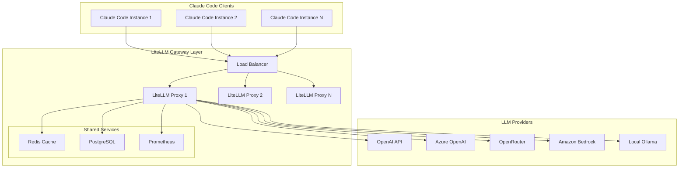

# Epic: LiteLLM Multi-Model Gateway Integration for Claude Code

## 🎯 Epic Overview

Implement a comprehensive LiteLLM proxy solution enabling Claude Code to seamlessly route requests to multiple non-Anthropic LLM providers through a unified, multi-tenant architecture.

## 📋 User Stories

### US-001: Multi-Provider Model Routing
**As a** developer  
**I want to** configure Claude Code to use different LLM providers  
**So that** I can optimize for cost, performance, and capability per task

**Acceptance Criteria:**
- [ ] Support for 10+ providers (OpenAI, Azure, OpenRouter, Bedrock, Ollama)
- [ ] Model aliasing system (map Claude names to provider models)
- [ ] Runtime model selection via CLI flags
- [ ] Transparent routing without code changes

### US-002: Multi-Tenant Architecture
**As a** system administrator  
**I want to** deploy LiteLLM with tenant isolation  
**So that** multiple teams can use different models and quotas

**Acceptance Criteria:**
- [ ] Tenant-specific configuration files
- [ ] API key isolation per tenant
- [ ] Usage tracking and quotas per tenant
- [ ] Tenant-based routing rules

### US-003: Cost Optimization
**As a** engineering manager  
**I want to** optimize LLM costs across providers  
**So that** we reduce operational expenses while maintaining quality

**Acceptance Criteria:**
- [ ] Cost tracking per model/provider
- [ ] Automatic fallback to cheaper providers
- [ ] Budget alerts and thresholds
- [ ] Usage reports and analytics

### US-004: Enterprise Compliance
**As a** compliance officer  
**I want to** ensure data governance and audit trails  
**So that** we meet regulatory requirements

**Acceptance Criteria:**
- [ ] Complete request/response logging
- [ ] PII detection and redaction
- [ ] Audit trail for all model usage
- [ ] Data residency controls

## 🏗️ Technical Architecture

### Components



### Model Routing Strategy

| Task Type | Primary Model | Fallback Model | Cost Tier |
|-----------|--------------|----------------|-----------|
| Code Generation | OpenRouter/Qwen3-Coder | OpenAI/Codex | Medium |
| Reasoning | OpenAI/o3-pro | Azure/GPT-4 | High |
| Refactoring | Local/Ollama | OpenRouter/DeepSeek | Low |
| Documentation | OpenAI/GPT-4o-mini | Anthropic/Claude-Haiku | Low |
| Security Analysis | Azure/GPT-4 | Bedrock/Claude | High |

## 📊 Implementation Phases

### Phase 1: Foundation (Week 1-2)
- [x] Create directory structure
- [ ] Basic LiteLLM proxy setup
- [ ] Docker containerization
- [ ] Single-tenant configuration
- [ ] OpenAI + OpenRouter integration

### Phase 2: Multi-Tenancy (Week 3-4)
- [ ] Tenant isolation architecture
- [ ] PostgreSQL integration for configs
- [ ] Redis caching layer
- [ ] API key management system
- [ ] Tenant routing middleware

### Phase 3: Advanced Features (Week 5-6)
- [ ] Cost tracking and optimization
- [ ] Prometheus metrics integration
- [ ] Grafana dashboards
- [ ] Alert system (budget, errors)
- [ ] Fallback logic implementation

### Phase 4: Enterprise Features (Week 7-8)
- [ ] Audit logging system
- [ ] PII detection/redaction
- [ ] Rate limiting per tenant
- [ ] A/B testing framework
- [ ] Model performance benchmarking

### Phase 5: Production Hardening (Week 9-10)
- [ ] High availability setup
- [ ] Disaster recovery procedures
- [ ] Security scanning
- [ ] Load testing
- [ ] Documentation and training

## 🔧 Technical Requirements

### Infrastructure
- Docker 20.10+
- Kubernetes 1.28+ (optional)
- PostgreSQL 15+
- Redis 7+
- Nginx or Traefik for load balancing

### Monitoring Stack
- Prometheus for metrics
- Grafana for visualization
- Loki for log aggregation
- AlertManager for notifications

### Security
- TLS 1.3 for all connections
- API key rotation mechanism
- Network segmentation
- Secrets management (Vault/K8s secrets)

## 📈 Success Metrics

### Performance KPIs
- Response time < 2s for 95th percentile
- 99.9% uptime SLA
- < 1% error rate
- Support for 1000+ concurrent requests

### Business KPIs
- 40% cost reduction vs direct Anthropic usage
- 90% developer satisfaction score
- < 5 minute onboarding for new tenants
- 100% audit compliance

## 🚀 Deployment Scenarios

### Local Development
```bash
docker-compose up -d
claude --model codex-mini "Write a function"
```

### Staging Environment
```bash
kubectl apply -f k8s/staging/
helm upgrade litellm ./charts/litellm
```

### Production
```bash
terraform apply -var="environment=production"
kubectl rollout restart deployment/litellm-proxy
```

## 📝 Configuration Examples

### Basic Tenant Config
```yaml
tenant: engineering-team
models:
  - alias: fast-code
    provider: openrouter/qwen/qwen3-coder
    max_tokens: 8192
  - alias: reasoning
    provider: openai/o3-pro
    max_tokens: 4096
budget:
  daily_limit: 100
  alert_threshold: 80
```

### Advanced Routing Rules
```yaml
routing:
  - pattern: "refactor*"
    model: local/ollama/deepseek
  - pattern: "security*"
    model: azure/gpt-4-turbo
  - pattern: "*"
    model: openrouter/qwen/qwen3-coder
    fallback: openai/gpt-4o-mini
```

## 🔐 Security Considerations

1. **API Key Management**
   - Encrypted storage in PostgreSQL
   - Regular rotation (30 days)
   - Audit trail for access

2. **Network Security**
   - Private subnets for LiteLLM proxies
   - WAF rules for public endpoints
   - DDoS protection

3. **Data Protection**
   - PII scanning before routing
   - Encryption at rest and in transit
   - GDPR compliance features

## 📚 Documentation Requirements

- [ ] API Reference Guide
- [ ] Tenant Onboarding Guide
- [ ] Operations Runbook
- [ ] Troubleshooting Guide
- [ ] Model Selection Best Practices
- [ ] Cost Optimization Playbook

## 🧪 Testing Strategy

### Unit Tests
- Model routing logic
- Tenant isolation
- Cost calculation
- Fallback mechanisms

### Integration Tests
- Provider connectivity
- End-to-end request flow
- Multi-tenant scenarios
- Cache behavior

### Performance Tests
- Load testing (1000+ RPS)
- Latency benchmarks
- Memory usage profiling
- Database query optimization

## 📅 Timeline

| Milestone | Date | Status |
|-----------|------|--------|
| Epic Kickoff | 2025-01-07 | ✅ Started |
| Phase 1 Complete | 2025-01-21 | 🔄 In Progress |
| Phase 2 Complete | 2025-02-04 | ⏳ Planned |
| Phase 3 Complete | 2025-02-18 | ⏳ Planned |
| Phase 4 Complete | 2025-03-04 | ⏳ Planned |
| Production Launch | 2025-03-18 | ⏳ Planned |

## 👥 Stakeholders

- **Product Owner**: LLM Platform Team
- **Technical Lead**: DevOps Architecture
- **Security Lead**: Compliance Team
- **Primary Users**: Engineering Teams
- **Executive Sponsor**: CTO Office

## 🔗 Related Issues

- #1234 - Implement cost tracking for LLM usage
- #1235 - Add support for Azure OpenAI
- #1236 - Create tenant management UI
- #1237 - Implement PII detection
- #1238 - Add Prometheus metrics

## 📎 Resources

- [LiteLLM Documentation](https://docs.litellm.ai)
- [Claude Code LLM Gateway Guide](https://docs.anthropic.com/en/docs/claude-code/llm-gateway)
- [OpenRouter API Reference](https://openrouter.ai/docs)
- [Multi-Tenant Architecture Patterns](https://docs.microsoft.com/en-us/azure/architecture/guide/multitenant/overview)

---

**Epic Status**: 🟢 Active  
**Priority**: P0 - Critical  
**Labels**: `infrastructure`, `llm-gateway`, `multi-tenant`, `cost-optimization`