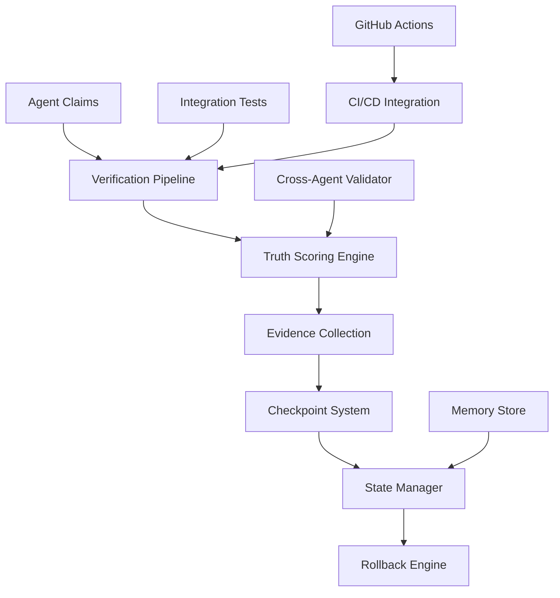
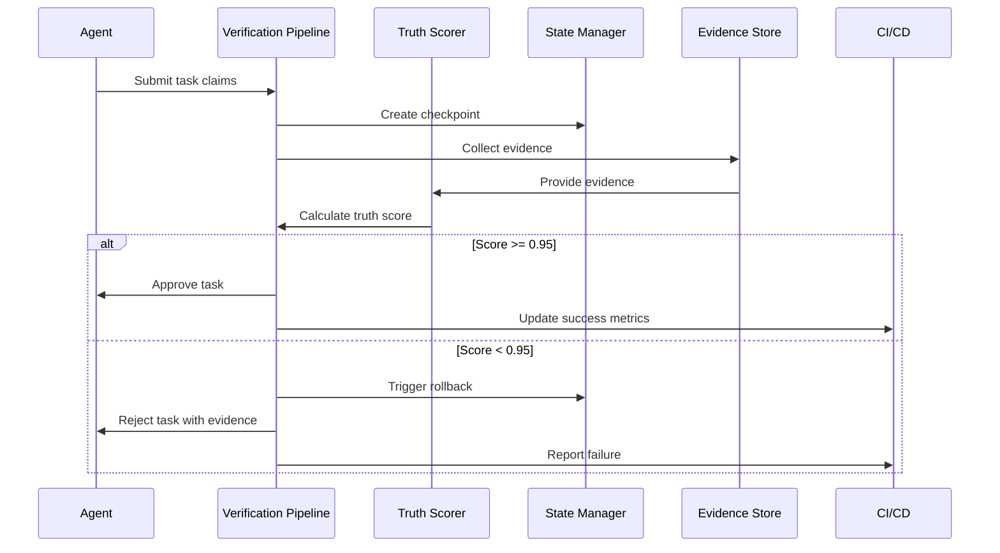
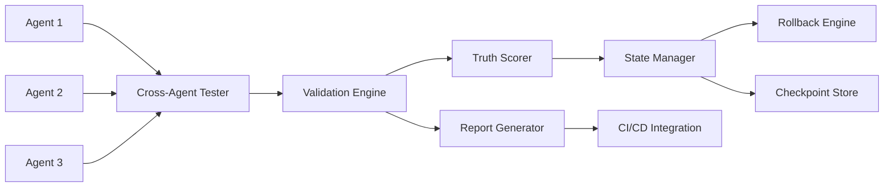

# Verification and Truth Enforcement Architecture

## Executive Summary

This document outlines a comprehensive verification and truth enforcement architecture for the Claude-Flow multi-agent system. The architecture ensures high-fidelity execution through mandatory checkpoints, truth scoring with a 0.95 minimum threshold, cross-agent integration testing, state management with rollback capabilities, and full GitHub Actions CI/CD integration.

## 1. Architecture Overview

### 1.1 Core Principles

- **Truth First**: All agent claims must be verified against reality with 95%+ accuracy
- **Fail Fast**: Early detection and correction of discrepancies
- **State Safety**: Complete rollback capabilities for failed operations
- **Continuous Verification**: Real-time monitoring and validation
- **Evidence-Based**: All decisions backed by measurable evidence

### 1.2 System Components



## 2. Verification Pipeline

### 2.1 Mandatory Checkpoints

The verification pipeline enforces mandatory checkpoints at critical stages:

#### Pre-Execution Checkpoints
- **Agent Capability Validation**: Verify agent has required capabilities
- **Resource Availability**: Ensure necessary resources are accessible
- **Dependency Verification**: Validate all dependencies are met
- **State Consistency**: Confirm system state is consistent

#### During-Execution Checkpoints
- **Progress Validation**: Verify intermediate results against expectations
- **Resource Monitoring**: Track resource usage and availability
- **Cross-Agent Consistency**: Ensure coordination between agents
- **Real-time Truth Scoring**: Continuous verification of claims

#### Post-Execution Checkpoints
- **Result Verification**: Validate final outputs against specifications
- **System Integrity**: Ensure no system corruption
- **Performance Metrics**: Collect and validate performance data
- **Truth Score Calculation**: Final truth score assessment

### 2.2 Checkpoint Implementation

```typescript
interface Checkpoint {
  id: string;
  type: 'pre' | 'during' | 'post';
  agent_id: string;
  task_id: string;
  timestamp: number;
  required: boolean;
  validations: Validation[];
  state_snapshot: StateSnapshot;
}

interface Validation {
  name: string;
  type: 'test' | 'lint' | 'type' | 'build' | 'integration' | 'performance';
  command: string;
  expected_result: any;
  actual_result?: any;
  passed: boolean;
  weight: number;
}
```

### 2.3 Pipeline Flow

```yaml
verification_pipeline:
  stages:
    - name: "pre_execution"
      checkpoints:
        - capability_check
        - resource_validation
        - dependency_verification
        - state_consistency
      failure_action: "abort"
      
    - name: "execution_monitoring"
      checkpoints:
        - progress_validation
        - resource_monitoring
        - cross_agent_sync
        - truth_scoring
      failure_action: "escalate"
      
    - name: "post_execution"
      checkpoints:
        - result_verification
        - system_integrity
        - performance_validation
        - final_truth_score
      failure_action: "rollback"
```

## 3. Truth Scoring System

### 3.1 Enhanced Truth Score Calculation

The truth scoring system evaluates agent claims against reality with enhanced precision:

```typescript
interface TruthScoreConfig {
  minimum_threshold: 0.95;
  weights: {
    tests: 0.30;
    integration_tests: 0.25;
    lint: 0.15;
    type_check: 0.15;
    build: 0.10;
    performance: 0.05;
  };
  evidence_requirements: {
    automated_tests: true;
    manual_verification: true;
    cross_agent_validation: true;
    system_integration: true;
  };
}
```

### 3.2 Evidence Collection Framework

```typescript
interface Evidence {
  test_results: {
    unit_tests: TestResults;
    integration_tests: TestResults;
    e2e_tests: TestResults;
    cross_agent_tests: TestResults;
  };
  code_quality: {
    lint_results: LintResults;
    type_results: TypeResults;
    complexity_metrics: ComplexityMetrics;
    security_scan: SecurityResults;
  };
  system_health: {
    build_results: BuildResults;
    deployment_status: DeploymentStatus;
    performance_metrics: PerformanceMetrics;
    resource_usage: ResourceMetrics;
  };
  agent_coordination: {
    communication_logs: CommunicationLogs;
    state_consistency: StateValidation;
    task_dependencies: DependencyValidation;
  };
}
```

### 3.3 Truth Score Calculation Algorithm

```typescript
class EnhancedTruthScoreCalculator {
  calculateTruthScore(evidence: Evidence, claims: AgentClaims): TruthScore {
    const weights = this.config.weights;
    let score = 0;
    const discrepancies: Discrepancy[] = [];
    
    // Test verification (30%)
    const testScore = this.verifyTestClaims(evidence.test_results, claims.test_claims);
    score += testScore.score * weights.tests;
    discrepancies.push(...testScore.discrepancies);
    
    // Integration verification (25%)
    const integrationScore = this.verifyIntegrationClaims(
      evidence.test_results.integration_tests, 
      claims.integration_claims
    );
    score += integrationScore.score * weights.integration_tests;
    discrepancies.push(...integrationScore.discrepancies);
    
    // Code quality verification (30%)
    const qualityScore = this.verifyQualityClaims(evidence.code_quality, claims.quality_claims);
    score += qualityScore.score * (weights.lint + weights.type_check);
    discrepancies.push(...qualityScore.discrepancies);
    
    // Build and deployment verification (10%)
    const buildScore = this.verifyBuildClaims(evidence.system_health, claims.build_claims);
    score += buildScore.score * weights.build;
    discrepancies.push(...buildScore.discrepancies);
    
    // Performance verification (5%)
    const perfScore = this.verifyPerformanceClaims(
      evidence.system_health.performance_metrics, 
      claims.performance_claims
    );
    score += perfScore.score * weights.performance;
    discrepancies.push(...perfScore.discrepancies);
    
    return {
      score: Math.round(score * 1000) / 1000,
      threshold: this.config.minimum_threshold,
      passed: score >= this.config.minimum_threshold,
      discrepancies,
      evidence_quality: this.assessEvidenceQuality(evidence),
      timestamp: Date.now()
    };
  }
}
```

## 4. Cross-Agent Integration Testing Framework

### 4.1 Agent Interaction Validation

```typescript
interface CrossAgentTest {
  id: string;
  name: string;
  participating_agents: string[];
  scenario: TestScenario;
  expected_outcomes: ExpectedOutcome[];
  validation_rules: ValidationRule[];
  dependencies: string[];
}

interface TestScenario {
  description: string;
  setup: SetupStep[];
  interactions: AgentInteraction[];
  teardown: CleanupStep[];
}

interface AgentInteraction {
  from_agent: string;
  to_agent: string;
  message_type: string;
  payload: any;
  expected_response: any;
  timeout_ms: number;
}
```

### 4.2 Integration Test Suite

```yaml
cross_agent_tests:
  - name: "coordination_handoff"
    agents: ["coordinator", "coder", "tester"]
    scenario:
      - coordinator_assigns_task
      - coder_implements_solution
      - tester_validates_implementation
      - coordinator_verifies_completion
    validations:
      - message_delivery_time < 1000ms
      - task_state_consistency
      - agent_response_accuracy > 95%
      
  - name: "parallel_execution"
    agents: ["researcher", "analyst", "optimizer"]
    scenario:
      - parallel_task_assignment
      - concurrent_execution
      - result_synchronization
    validations:
      - no_resource_conflicts
      - data_consistency
      - completion_within_timeout
      
  - name: "error_recovery"
    agents: ["coordinator", "monitor", "recovery"]
    scenario:
      - inject_error_condition
      - monitor_detects_failure
      - recovery_initiates_rollback
      - coordinator_reassigns_task
    validations:
      - error_detection_time < 5000ms
      - successful_rollback
      - task_reassignment_successful
```

### 4.3 Test Execution Engine

```typescript
class CrossAgentTestExecutor {
  async executeTestSuite(suite: CrossAgentTestSuite): Promise<TestResults> {
    const results: TestResults = {
      total_tests: suite.tests.length,
      passed: 0,
      failed: 0,
      test_details: []
    };
    
    for (const test of suite.tests) {
      const result = await this.executeTest(test);
      results.test_details.push(result);
      
      if (result.passed) {
        results.passed++;
      } else {
        results.failed++;
      }
    }
    
    return results;
  }
  
  private async executeTest(test: CrossAgentTest): Promise<TestResult> {
    const testContext = await this.setupTestContext(test);
    
    try {
      // Execute scenario
      await this.executeScenario(test.scenario, testContext);
      
      // Validate outcomes
      const validationResults = await this.validateOutcomes(
        test.expected_outcomes,
        test.validation_rules,
        testContext
      );
      
      return {
        test_id: test.id,
        passed: validationResults.all_passed,
        details: validationResults.details,
        execution_time_ms: testContext.execution_time,
        evidence: testContext.evidence
      };
    } catch (error) {
      return {
        test_id: test.id,
        passed: false,
        error: error.message,
        execution_time_ms: testContext.execution_time
      };
    } finally {
      await this.cleanupTestContext(testContext);
    }
  }
}
```

## 5. State Management and Rollback Capabilities

### 5.1 State Snapshot System

```typescript
interface StateSnapshot {
  id: string;
  timestamp: number;
  agent_states: Map<string, AgentState>;
  system_state: SystemState;
  task_states: Map<string, TaskState>;
  memory_state: MemoryState;
  file_system_state: FileSystemState;
  database_state: DatabaseState;
  checksum: string;
}

interface AgentState {
  id: string;
  status: 'idle' | 'active' | 'error' | 'suspended';
  current_task: string | null;
  capabilities: string[];
  memory: AgentMemory;
  configuration: AgentConfig;
  performance_metrics: PerformanceMetrics;
}
```

### 5.2 Rollback Engine

```typescript
class RollbackEngine {
  async createCheckpoint(
    description: string,
    agents: string[],
    scope: 'local' | 'system' | 'global'
  ): Promise<string> {
    const checkpoint_id = generateId();
    const snapshot = await this.captureSystemState(agents, scope);
    
    await this.stateStore.saveSnapshot(checkpoint_id, snapshot);
    await this.auditLogger.logCheckpoint(checkpoint_id, description, agents);
    
    return checkpoint_id;
  }
  
  async rollbackToCheckpoint(
    checkpoint_id: string,
    verification_mode: 'strict' | 'partial' | 'force'
  ): Promise<RollbackResult> {
    const snapshot = await this.stateStore.getSnapshot(checkpoint_id);
    
    if (!snapshot) {
      throw new Error(`Checkpoint ${checkpoint_id} not found`);
    }
    
    // Verify rollback is safe
    if (verification_mode === 'strict') {
      const safetyCheck = await this.verifySafeRollback(snapshot);
      if (!safetyCheck.safe) {
        throw new Error(`Unsafe rollback: ${safetyCheck.reasons.join(', ')}`);
      }
    }
    
    // Execute rollback
    const rollback_start = Date.now();
    
    try {
      // Suspend all agents
      await this.suspendAllAgents();
      
      // Restore states
      await this.restoreAgentStates(snapshot.agent_states);
      await this.restoreSystemState(snapshot.system_state);
      await this.restoreTaskStates(snapshot.task_states);
      await this.restoreMemoryState(snapshot.memory_state);
      await this.restoreFileSystemState(snapshot.file_system_state);
      await this.restoreDatabaseState(snapshot.database_state);
      
      // Resume agents
      await this.resumeAllAgents();
      
      // Verify rollback success
      const verification = await this.verifyRollbackSuccess(snapshot);
      
      return {
        success: verification.verified,
        checkpoint_id,
        rollback_time_ms: Date.now() - rollback_start,
        verification_details: verification.details
      };
    } catch (error) {
      // Emergency recovery
      await this.emergencyRecovery();
      throw new Error(`Rollback failed: ${error.message}`);
    }
  }
}
```

### 5.3 State Consistency Validation

```typescript
class StateConsistencyValidator {
  async validateSystemConsistency(): Promise<ConsistencyReport> {
    const checks = await Promise.all([
      this.validateAgentConsistency(),
      this.validateTaskConsistency(),
      this.validateMemoryConsistency(),
      this.validateFileSystemConsistency(),
      this.validateDatabaseConsistency()
    ]);
    
    const inconsistencies = checks.flatMap(check => check.inconsistencies);
    
    return {
      consistent: inconsistencies.length === 0,
      inconsistencies,
      checked_at: new Date().toISOString(),
      repair_suggestions: this.generateRepairSuggestions(inconsistencies)
    };
  }
  
  private async validateAgentConsistency(): Promise<ConsistencyCheck> {
    const agents = await this.agentManager.getAllAgents();
    const inconsistencies: Inconsistency[] = [];
    
    for (const agent of agents) {
      // Validate agent state
      if (agent.current_task && !await this.taskExists(agent.current_task)) {
        inconsistencies.push({
          type: 'orphaned_task_reference',
          agent_id: agent.id,
          details: `Agent references non-existent task: ${agent.current_task}`
        });
      }
      
      // Validate memory consistency
      if (!await this.validateAgentMemory(agent)) {
        inconsistencies.push({
          type: 'memory_corruption',
          agent_id: agent.id,
          details: 'Agent memory state is corrupted'
        });
      }
    }
    
    return {
      component: 'agents',
      inconsistencies
    };
  }
}
```

## 6. GitHub Actions and CI/CD Integration

### 6.1 CI/CD Pipeline Configuration

```yaml
# .github/workflows/verification.yml
name: Verification and Truth Enforcement

on:
  push:
    branches: [ main, develop ]
  pull_request:
    branches: [ main ]
  workflow_dispatch:

jobs:
  pre_verification:
    name: Pre-Execution Verification
    runs-on: ubuntu-latest
    steps:
      - uses: actions/checkout@v4
      
      - name: Setup Node.js
        uses: actions/setup-node@v4
        with:
          node-version: '20'
          cache: 'npm'
      
      - name: Install dependencies
        run: npm ci
      
      - name: Run capability verification
        run: npx claude-flow verification check-capabilities
      
      - name: Validate agent configurations
        run: npx claude-flow verification validate-agents
      
      - name: Check system prerequisites
        run: npx claude-flow verification check-prerequisites

  truth_scoring:
    name: Truth Score Validation
    needs: pre_verification
    runs-on: ubuntu-latest
    steps:
      - uses: actions/checkout@v4
      
      - name: Run unit tests
        run: npm test
      
      - name: Run integration tests
        run: npm run test:integration
      
      - name: Run cross-agent tests
        run: npx claude-flow verification run-cross-agent-tests
      
      - name: Calculate truth score
        id: truth_score
        run: |
          SCORE=$(npx claude-flow verification calculate-truth-score)
          echo "score=$SCORE" >> $GITHUB_OUTPUT
      
      - name: Validate truth threshold
        run: |
          if (( $(echo "${{ steps.truth_score.outputs.score }} < 0.95" | bc -l) )); then
            echo "Truth score ${{ steps.truth_score.outputs.score }} below threshold 0.95"
            exit 1
          fi

  state_management:
    name: State Management Validation
    needs: truth_scoring
    runs-on: ubuntu-latest
    steps:
      - uses: actions/checkout@v4
      
      - name: Create test checkpoint
        run: npx claude-flow verification create-checkpoint "ci_test"
      
      - name: Simulate state changes
        run: npx claude-flow verification simulate-changes
      
      - name: Test rollback capability
        run: npx claude-flow verification test-rollback "ci_test"
      
      - name: Validate state consistency
        run: npx claude-flow verification validate-consistency

  deployment_verification:
    name: Deployment Verification
    needs: [truth_scoring, state_management]
    runs-on: ubuntu-latest
    if: github.ref == 'refs/heads/main'
    steps:
      - uses: actions/checkout@v4
      
      - name: Deploy to staging
        run: npx claude-flow deploy staging
      
      - name: Run end-to-end verification
        run: npx claude-flow verification run-e2e-tests staging
      
      - name: Validate production readiness
        run: npx claude-flow verification validate-production-readiness
      
      - name: Generate verification report
        run: npx claude-flow verification generate-report
        
      - name: Upload verification artifacts
        uses: actions/upload-artifact@v4
        with:
          name: verification-report
          path: reports/verification-*.json
```

### 6.2 GitHub Actions Integration Points

```typescript
class GitHubActionsIntegration {
  async setupVerificationWorkflow(repo: string, config: VerificationConfig): Promise<void> {
    const workflow = this.generateWorkflow(config);
    await this.githubAPI.createWorkflow(repo, '.github/workflows/verification.yml', workflow);
    
    // Setup required checks
    await this.githubAPI.updateBranchProtection(repo, 'main', {
      required_status_checks: {
        strict: true,
        contexts: [
          'Pre-Execution Verification',
          'Truth Score Validation',
          'State Management Validation'
        ]
      },
      enforce_admins: true,
      required_pull_request_reviews: {
        required_approving_review_count: 2,
        dismiss_stale_reviews: true
      }
    });
  }
  
  async triggerVerificationOnPR(pr: PullRequest): Promise<VerificationResult> {
    // Trigger verification workflow
    const workflow_run = await this.githubAPI.triggerWorkflow(
      pr.repository,
      'verification.yml',
      {
        ref: pr.head.ref,
        inputs: {
          pr_number: pr.number.toString(),
          verification_mode: 'strict'
        }
      }
    );
    
    // Wait for completion and collect results
    const result = await this.waitForWorkflowCompletion(workflow_run.id);
    
    // Update PR with verification status
    await this.updatePRStatus(pr, result);
    
    return result;
  }
}
```

## 7. Component Interfaces and APIs

### 7.1 Verification Manager Interface

```typescript
interface VerificationManager {
  // Checkpoint management
  createCheckpoint(description: string, scope: CheckpointScope): Promise<string>;
  listCheckpoints(filter?: CheckpointFilter): Promise<Checkpoint[]>;
  deleteCheckpoint(id: string): Promise<void>;
  
  // Truth scoring
  calculateTruthScore(evidence: Evidence, claims: AgentClaims): Promise<TruthScore>;
  storeTruthScore(score: TruthScore): Promise<void>;
  getAgentReliability(agent_id: string): Promise<ReliabilityReport>;
  
  // State management
  captureSystemState(scope: StateScope): Promise<StateSnapshot>;
  rollbackToCheckpoint(checkpoint_id: string, mode: RollbackMode): Promise<RollbackResult>;
  validateStateConsistency(): Promise<ConsistencyReport>;
  
  // Integration testing
  runCrossAgentTests(suite?: string): Promise<TestResults>;
  validateAgentCommunication(): Promise<CommunicationReport>;
  
  // Reporting
  generateVerificationReport(format: 'json' | 'html' | 'markdown'): Promise<string>;
  exportMetrics(timeframe: string): Promise<MetricsExport>;
}
```

### 7.2 Agent Integration Interface

```typescript
interface AgentVerificationInterface {
  // Required by all agents
  validateCapabilities(): Promise<CapabilityValidation>;
  reportTaskClaims(task_id: string, claims: TaskClaims): Promise<void>;
  provideEvidence(task_id: string): Promise<Evidence>;
  
  // State management
  saveState(): Promise<AgentState>;
  restoreState(state: AgentState): Promise<void>;
  validateState(): Promise<StateValidation>;
  
  // Communication verification
  validateMessage(message: AgentMessage): Promise<MessageValidation>;
  reportCommunicationMetrics(): Promise<CommunicationMetrics>;
}
```

## 8. Data Flow Diagrams

### 8.1 Verification Pipeline Data Flow



### 8.2 Cross-Agent Integration Flow



## 9. Implementation Roadmap

### Phase 1: Core Infrastructure (Weeks 1-2)
- Implement basic verification pipeline
- Create truth scoring engine
- Setup checkpoint system
- Basic state management

### Phase 2: Integration Testing (Weeks 3-4)
- Cross-agent test framework
- Agent communication validation
- Integration with existing agents
- Performance optimization

### Phase 3: Advanced Features (Weeks 5-6)
- Advanced rollback capabilities
- State consistency validation
- Evidence collection automation
- GitHub Actions integration

### Phase 4: Production Hardening (Weeks 7-8)
- Security auditing
- Performance tuning
- Documentation completion
- Production deployment

## 10. Security Considerations

### 10.1 Verification Security
- All verification processes run in isolated environments
- Evidence collection uses read-only access where possible
- State snapshots are encrypted at rest
- Rollback operations require multi-factor authorization

### 10.2 Truth Score Integrity
- Truth scores are cryptographically signed
- Evidence provenance is tracked and verified
- Audit logs are immutable and distributed
- Regular integrity checks on stored data

## 11. Monitoring and Alerting

### 11.1 Key Metrics
- Truth score distribution across agents
- Verification pipeline latency
- Rollback frequency and success rate
- State consistency violation frequency
- Cross-agent test pass rates

### 11.2 Alert Conditions
- Truth score below threshold (0.95)
- Verification pipeline failure
- State inconsistency detected
- Rollback operation required
- Cross-agent communication failure

## 12. Conclusion

This verification and truth enforcement architecture provides a robust foundation for ensuring high-fidelity execution in the Claude-Flow multi-agent system. By implementing mandatory checkpoints, rigorous truth scoring, comprehensive integration testing, and reliable state management, the system can maintain exceptional reliability and trust.

The architecture is designed to be:
- **Scalable**: Handles increasing numbers of agents and tasks
- **Reliable**: Comprehensive error detection and recovery
- **Secure**: Protected against various attack vectors
- **Observable**: Rich monitoring and reporting capabilities
- **Maintainable**: Clear interfaces and modular design

Implementation should follow the phased approach outlined, with continuous testing and validation at each stage to ensure the system meets its stringent reliability requirements.